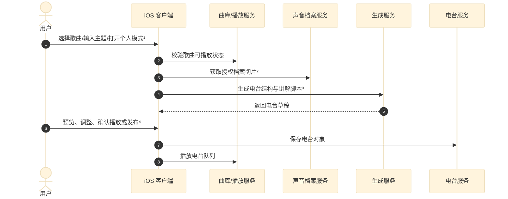
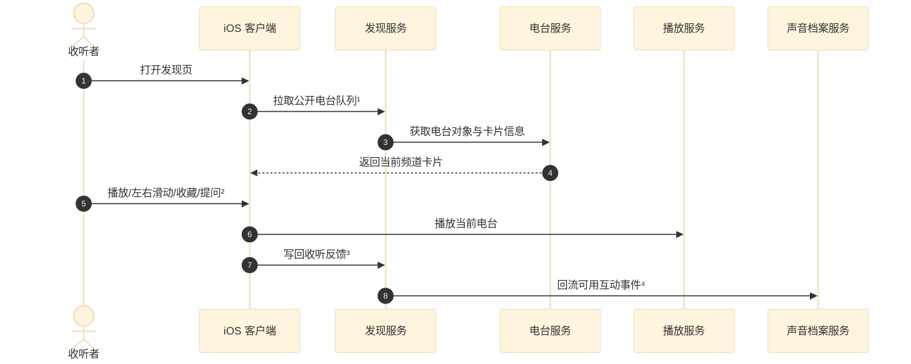
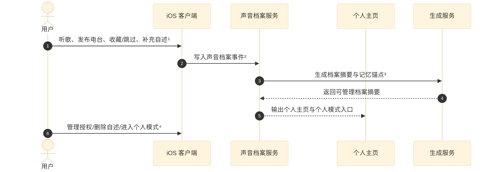

# 声音档案与 Discover Radio PRD V0.5.2

## 1. 文档信息与更新记录

| 字段 | 内容 |
|---|---|
| 产品名称 | 暂定名：Discover Radio |
| 文档名称 | 声音档案与 Discover Radio PRD V0.5.2 |
| 版本定义 | V0.1.0 为初版概念；V0.2.0 引入声音档案；V0.3.0-V0.4.7 围绕歌单分享形态、声音档案、个人电台和模型选型持续收敛；V0.5.0 将对外分享形态重构为 Discover 电台流；V0.5.1 将产品主结构重构为电台模块、发现模块、声音档案模块；V0.5.2 删除 Prompt 工程设计章节 |
| 适用端 | iOS first |
| 当前工程基础 | SwiftUI iOS app，已有音乐播放、用户主页、授权和基础页面原型；原分享页需要调整为 Discover/发现入口 |
| 目标读者 | 产品、设计、iOS、后端、AI 工程、黑客松评审 |

| 版本 | 更新记录 | 修改时间 |
|---|---|---|
| V0.1.0 | 初始 PRD | 2026-06-18 |
| V0.2.0 | 明确声音档案作为个人音乐数据沉淀，个人电台作为声音档案内的自我收听能力 | 2026-06-18 |
| V0.4.0 | 重构需求描述，按基础功能和 AI 功能分层，再按模块展开需求清单 | 2026-06-19 |
| V0.4.5 | 重构模型选型，按文字、语音、图片/视觉分类比较豆包、DeepSeek、MiniMax、MiMo、Kimi、Qwen 等模型 | 2026-06-19 |
| V0.5.0 | 将对外分享形态改为 Discover 电台流，去掉原地图化分享概念 | 2026-06-19 |
| V0.5.1 | 将主模块统一为电台模块、发现模块、声音档案模块；个人电台降级为电台模块中的个人模式 | 2026-06-19 |
| V0.5.2 | 删除 Prompt 工程设计章节，保留模型选型作为最后一章 | 2026-06-19 |

## 2. 背景

### 2.1 业务背景：音乐作为记忆载体

我们总会在不同的人生阶段喜欢上不同的歌手或曲风。音乐品味的变化，某种程度上显示出成长的轨迹；我们也会在某个阶段反复聆听某些歌曲，直到多年后再次听到它，瞬间回到某个夏天，才意识到音乐早已成为记忆的载体。

这背后有一个心理学现象作为支撑：普鲁斯特效应（Proust Effect）。气味、声音等感官信号能以异乎寻常的清晰度唤起情感记忆，音乐是其中最强烈的触发器之一，却也是最少被主动记录的一种。音乐因此呈现出一种悖论：它最容易陪伴情绪，却最难被主动记录。

传统歌单分享解决的是“把几首歌发给别人”，但没有真正解决“让别人听见这几首歌背后的我”。接收者看到的是一个 list，缺少收听场景、讲解口吻、歌曲之间的关系，也缺少一种像调频一样自然的发现方式。

本产品要升级的不是音乐日记，也不是普通歌单工具，而是把个人音乐数据、电台化表达和发现机制连成一套完整体验：声音档案沉淀个人音乐轨迹，电台模块把一段音乐表达制作成可听频道，发现模块让不同人的频道被左右滑动听见。

### 2.2 产品定义：从声音档案到可发现的用户电台

产品的核心闭环是：

```text
声音档案沉淀个人音乐轨迹
-> 电台模块把一段音乐表达制作成可听频道
-> 发现模块把不同用户电台以收音机形式分发
-> 收听、互动、发布结果回流声音档案
```

核心概念定义：

| 概念 | 定义 | 不是什么 |
|---|---|---|
| 电台模块 | 产品的核心内容单元与播放体验，负责创建电台、生成结构/讲解、播放控制、系统 DJ、草稿预览和公开发布 | 不承担频道分发，不等同于个人主页 |
| 发现模块 | 电台分发与浏览入口，以收音机卡片呈现不同用户的公开电台，支持左右滑动切换 | 不是传统歌单列表，不生产完整声音档案 |
| 声音档案模块 | 用户长期音乐数据、阶段性偏好、记忆锚点、公开电台、互动反馈和可选自述沉淀出的个人音乐档案 | 不是公开听歌隐私库，不自动替用户发布 |
| 电台对象 | 一段可播放、可讲解、可收藏、可分享的音乐频道，可以来自手动选歌，也可以来自个人模式推荐 | 不是无限流推荐队列，也不是完整私密歌单 |
| 个人模式 | 电台模块中面向用户本人的收听模式，入口位于声音档案，用于回放自己、获得公开发布灵感 | 不是独立主模块，不会自动公开用户内容 |
| 声音档案分身 | 基于授权声音档案切片回答当前电台相关问题的交互角色 | 默认不等于真实克隆声音，不代表发布者本人发言 |

### 2.3 三模块关系与产品创新点

> 声音档案记录我如何被音乐塑造，电台把这部分自我做成可听频道，发现让不同人的频道被左右滑动听见。

| 主模块 | 体验价值 | 用户问题 | 产品回答 |
|---|---|---|---|
| 声音档案模块 | 向内沉淀 | 我一路听过什么？哪些歌在不同阶段陪过我？ | 把长期听歌轨迹、曲风变化、记忆锚点、公开电台和互动反馈收拢成一份个人音乐档案 |
| 电台模块 | 表达与回响 | 我如何把一段音乐选择变成别人愿意连续听下去的频道？我如何重新听见此刻的自己？ | 把歌曲、主题和声音档案切片生成电台结构、讲解和播放体验，支持公开电台和个人模式 |
| 发现模块 | 向外连接 | 我如何像调频一样听见不同的人，而不是一个个点开歌单？ | 用收音机卡片展示不同用户公开电台，左右滑动切换频道，并把收听反馈回流到后续推荐 |

三者不再是彼此平行的独立产品，而是同一条链路上的不同职责：

| 模块 | 输入 | 输出 | 与其他模块的关系 |
|---|---|---|---|
| 声音档案模块 | 听歌行为、发布记录、收藏/跳过/提问、可选自述 | 档案摘要、记忆锚点、授权档案切片、个人主页 | 为电台生成提供个人化素材；接收电台和发现反馈 |
| 电台模块 | 歌曲选择、主题、档案切片、场景信息 | 电台对象、讲解脚本、播放队列、系统 DJ 音频、发布草稿 | 消费声音档案素材；产出可进入发现模块的公开电台 |
| 发现模块 | 公开电台池、用户偏好、收听反馈、推荐排序信号 | 发现队列、收音机卡片、滑动结果、互动反馈 | 分发电台模块产物；把收听行为回流声音档案 |

### 2.4 产品目标

| 类型 | V0.5.2 目标 | 衡量指标 |
|---|---|---|
| 用户目标 | 用户能创建并播放一段有个人感的电台；收听者能在发现页连续听见不同用户的频道 | 电台发布 <= 60 秒；左右滑动切换 P95 <= 1 秒 |
| 模型目标 | 电台脚本自然、歌曲关系解释准确、声音档案分身不编造、不越界 | 首版以人工验收和演示稳定性为主 |
| 技术目标 | iOS 端完成电台播放/创建、发现页左右滑动、声音档案主页和基础 AI 生成链路 | 核心路径无 P0 崩溃；电台生成 P95 <= 8 秒 |

## 3. 核心模块设计

为避免单张时序图信息过密，系统实现拆成三个核心模块展示：`电台模块`负责把歌曲制作成可播放频道，`发现模块`负责公开电台的浏览和切换，`声音档案模块`负责个人音乐数据沉淀和授权切片。

### 3.1 电台模块

电台模块是产品的核心内容单元。它既支持用户创建公开电台，也支持从声音档案入口进入个人模式，生成只面向自己的回放队列和公开发布灵感。



角标说明：

| 角标 | 说明 |
|---|---|
| ¹ | 电台可以来自手动选歌，也可以来自声音档案中的个人模式推荐；个人模式生成内容默认私密。 |
| ² | 授权档案切片只包含本次生成所需的偏好、公开电台摘要、音乐口吻和边界，不读取完整私密档案。 |
| ³ | 生成内容包含电台标题、播放顺序、歌曲角色、开场、过渡、讲解和结尾。 |
| ⁴ | 公开发布前必须由用户确认；用户也可以只播放个人模式，不进入发现模块。 |

### 3.2 发现模块

发现模块负责公开电台的浏览与分发。用户进入后看到收音机形态的电台卡片，可以左右滑动切换不同用户的频道。



角标说明：

| 角标 | 说明 |
|---|---|
| ¹ | 队列只包含公开或链接可见且允许进入发现池的电台对象。 |
| ² | 首版主交互是左右滑动切换频道；上下滑动不作为首版主路径。 |
| ³ | 反馈包括播放、跳过、收藏、停留、分享、提问和问答评价，用于后续排序。 |
| ⁴ | 回流到声音档案的是用户自己的互动信号，不暴露其他用户的私密档案。 |

### 3.3 声音档案模块

声音档案模块负责沉淀用户如何被音乐塑造，也负责给电台模块提供可控的个人化素材。它不是公开隐私库，而是用户可管理、可撤回、可授权使用的音乐数据资产。



角标说明：

| 角标 | 说明 |
|---|---|
| ¹ | 输入来源包括日常播放、公开电台发布、发现页互动、用户自述和可选录音开场。 |
| ² | 声音档案事件默认私密，用户应能关闭、删除或撤回主动补充内容。 |
| ³ | 汇总结果包括阶段性偏好、记忆锚点、音乐口吻；不直接替用户下情绪或人生结论。 |
| ⁴ | 个人模式的入口在声音档案中，但生成和播放能力归属于电台模块。 |

LLM 调用节点要求：

| 节点 | 所属模块 | 输入 | 输出 | 预期延迟 | 超时 |
|---|---|---|---|---|---|
| 电台结构与脚本生成 | 电台模块 | 候选歌曲、主题、授权档案切片、目标语气 | JSON：电台标题、播放顺序、歌曲角色、开场、过渡、讲解 | <= 6 秒 | 10 秒 |
| 个人模式队列生成 | 电台模块 | 声音档案摘要、天气、时间、城市级位置、候选歌曲 | JSON：个人电台队列、推荐理由、公开发布灵感 | <= 6 秒 | 10 秒 |
| 发现排序与卡片文案 | 发现模块 | 公开电台池、收听者偏好、播放反馈、电台标签 | JSON：推荐分数、频道卡片文案、下一频道解释 | <= 4 秒 | 8 秒 |
| 声音档案摘要与授权切片 | 声音档案模块 | 听歌事件、发布记录、互动反馈、用户自述 | JSON：档案摘要、记忆锚点、可授权切片、边界说明 | <= 6 秒 | 10 秒 |
| 声音档案分身问答 | 声音档案模块 | 当前电台内容、授权档案切片、收听者问题、安全边界 | JSON：回答、引用歌曲、置信度、拒答原因 | <= 4 秒 | 8 秒 |

## 4. 需求描述

本章按能力性质拆成两层：`基础功能需求`定义用户可见的页面、播放、发布、发现和权限能力；`AI 功能需求`定义模型参与生成、讲解、排序、问答和档案沉淀的能力。基础功能要先能独立跑通，AI 功能在此之上提供“可听懂、可互动、可回响”的体验。

### 4.1 基础功能需求

基础功能不描述模型如何生成内容，只描述用户可以如何进入、创建、播放、浏览、分享和管理。AI 生成失败时，基础功能仍应保证电台可以以简化形态被发布、播放和发现。

#### 4.1.1 电台模块

| 编号 | 需求点 | 优先级 | 用户角色 | 需求描述 | 验收标准 |
|---|---|---|---|---|---|
| BF-RAD-01 | 电台创建入口与歌曲选择 | P0 | 发布者 / 用户本人 | 用户可搜索或从候选列表选择歌曲，也可从声音档案个人模式生成候选队列。 | 用户能完成歌曲选择；每首歌展示歌名、歌手、封面和可用播放信息。 |
| BF-RAD-02 | 电台草稿与发布前预览 | P0 | 发布者 | 发布前展示歌曲、标题、收音机卡片样式、讲解状态、可见性和可选录音开场状态。 | 发布者可预览并返回修改；确认后保存草稿或发布状态。 |
| BF-RAD-03 | 电台播放与播放控制 | P0 | 用户本人 / 收听者 | 支持 Apple Music 授权播放；无授权时使用本地 preview 或 mock 曲目完成演示；支持播放、暂停、上一首/下一首和进度展示。 | 授权成功可播放 Apple Music 曲目；未授权时仍可用 preview 播放；切换电台后播放态正确更新。 |
| BF-RAD-04 | 可见性与发布确认 | P0 | 发布者 | 发布时可设置公开、仅链接可见或私密草稿；个人模式内容默认私密。 | 未确认前不公开；私密草稿不会出现在发现页；公开电台可进入发现池。 |
| BF-RAD-05 | 电台分享卡片与链接 | P1 | 发布者 | 用户可生成电台分享卡片或链接，卡片包含收音机视觉、标题、发布者和进入入口。 | 可复制链接或调起 iOS 系统分享；接收方打开后进入同一个电台。 |
| BF-RAD-06 | 发布者录音开场管理 | P1 | 发布者 | 用户可主动录制或删除电台开场录音；删除后不再播放或用于展示。 | 删除操作即时生效；已发布电台回退到系统 DJ 或文本开场。 |

#### 4.1.2 发现模块

| 编号 | 需求点 | 优先级 | 用户角色 | 需求描述 | 验收标准 |
|---|---|---|---|---|---|
| BF-DIS-01 | 发现主入口与收音机卡片 | P0 | 收听者 | App 首版主入口为发现页，以收音机形态展示单个公开电台，包含发布者、标题、封面/视觉、播放状态和互动入口。 | 首屏不是普通列表；用户能明确感知“正在调到某个人的频道”。 |
| BF-DIS-02 | 左右滑动切换频道 | P0 | 收听者 | 用户左右滑动切换上一个/下一个公开电台。 | 切换 P95 <= 1 秒；切换后播放内容、发布者信息和互动状态同步刷新。 |
| BF-DIS-03 | 发现队列加载与空态兜底 | P0 | 收听者 | 发现页拉取公开电台队列；无网络、无电台或加载失败时展示可播放兜底内容。 | 异常状态不白屏；用户至少能播放 demo 电台或重新加载。 |
| BF-DIS-04 | 当前电台详情与发布者入口 | P1 | 收听者 | 收听者可查看当前电台的歌曲信息、发布者主页入口和基础说明。 | 电台详情可打开和关闭；发布者入口可跳转到公开主页。 |
| BF-DIS-05 | 收藏、跳过与收听反馈 | P1 | 收听者 | 收听者可收藏电台、跳过频道，并产生停留、播放、提问等轻量反馈。 | 收藏后状态有反馈；重新进入后可找到该电台；反馈能写入发现排序事件。 |

#### 4.1.3 声音档案模块

| 编号 | 需求点 | 优先级 | 用户角色 | 需求描述 | 验收标准 |
|---|---|---|---|---|---|
| BF-ARC-01 | 声音档案入口与个人主页 | P0 | 用户本人 | 用户能进入个人主页/声音档案，查看自己的音乐轨迹、公开电台和个人模式入口。 | 用户能找到个人主页、声音档案摘要、已发布电台和个人模式入口。 |
| BF-ARC-02 | 听歌统计与阶段变化展示 | P1 | 用户本人 | 展示听歌数量、常听歌手/曲风、阶段变化、记忆节点或人格标签。 | 页面能呈现基础统计和阶段性变化；文案不替用户下绝对情绪结论。 |
| BF-ARC-03 | 档案中的电台集合 | P1 | 用户本人 | 个人主页展示用户发布过、收藏过或从个人模式保存过的电台。 | 用户能看到电台集合，并能重新打开播放。 |
| BF-ARC-04 | 数据来源与授权管理 | P0 | 用户本人 | 用户可查看声音档案数据来源，关闭部分使用范围或清空主动补充内容；默认不公开完整声音档案。 | 关闭或清空后相关内容不再用于后续展示和 AI 调用；收听者无法看到完整声音档案。 |
| BF-ARC-05 | 个人模式入口 | P1 | 用户本人 | 声音档案提供个人模式入口，用户可基于当前场景重新收听自己的声音档案。 | 入口清晰；进入后生成的是私密电台队列，必须用户确认后才可公开发布。 |

### 4.2 AI 功能需求

AI 能力按三个产品模块归类：`电台模块 AI`负责把歌曲变成可听频道；`发现模块 AI`负责频道排序、卡片文案和反馈归因；`声音档案模块 AI`负责档案摘要、授权切片和分身问答。个人模式不再作为一级 AI 模块，它是电台模块在声音档案入口下的使用场景。

#### 4.2.1 电台模块 AI

| 编号 | AI 子能力 | 优先级 | 需求描述 | 能力边界 | 验收标准 |
|---|---|---|---|---|---|
| AI-RAD-01 | 场景理解 | P0 | 读取时间、天气、城市级位置和最近听歌行为，生成当前收听状态。 | 不使用精确位置；不判断用户真实心理状态。 | 缺少天气或位置时仍可生成；输出包含场景摘要、推荐语气和收听意图。 |
| AI-RAD-02 | 电台队列/结构生成 | P0 | 基于歌曲、主题和档案切片生成公开电台或个人模式队列。 | 只能从可播放候选歌曲中选择；个人模式不自动公开。 | 每首歌都有播放角色、短解释和播放顺序；前端可直接消费结构化结果。 |
| AI-RAD-03 | 电台主题、标题与播放角色生成 | P0 | 判断这段电台可以被理解成什么主题，并给出标题、一句话解释和歌曲角色。 | 不写成音乐日记；不编造发布者故事。 | 生成结果能解释“这段电台为什么这样编排”。 |
| AI-RAD-04 | 电台脚本与讲解 | P0 | 生成开场、歌曲间过渡、每首歌讲解和结尾语。 | 不编造歌曲事实；不冒充发布者本人。 | 每首歌都有讲解；脚本可用于系统 DJ 或文本展示。 |
| AI-RAD-05 | 语音策略与系统 DJ 讲解 | P1 | 判断当前电台使用系统 DJ、发布者真人录音开场或仅文本讲解。 | 首版默认不使用分享者克隆声；真人录音必须由用户主动上传并可删除。 | 无录音时使用系统 DJ；有录音时只用于用户主动录制的开场。 |
| AI-RAD-06 | 公开电台草稿/发布灵感生成 | P1 | 从个人模式或手动选歌中提出可公开发布的电台草稿。 | 只能作为草稿灵感，必须由用户确认后才能发布。 | 草稿包含标题、候选歌曲、分享角度和可见性提示。 |

#### 4.2.2 发现模块 AI

| 编号 | AI 子能力 | 优先级 | 需求描述 | 能力边界 | 验收标准 |
|---|---|---|---|---|---|
| AI-DIS-01 | Discover 电台排序辅助 | P1 | 基于用户偏好、播放反馈和电台内容生成推荐排序信号。 | 不使用未授权声音档案；不把私人听歌数据暴露给其他用户。 | 左右滑动队列能持续返回可播放电台；反馈能影响后续排序。 |
| AI-DIS-02 | 发现卡片短文案生成 | P1 | 为收音机卡片生成短标题、副标题和调频提示。 | 不制造夸张人设；不泄露声音档案细节。 | 文案能表达电台主题，并适合卡片展示。 |
| AI-DIS-03 | 收听反馈归因 | P2 | 把播放、跳过、收藏、停留和提问行为转成发现排序可用信号。 | 不形成敏感画像；不对外展示个体反馈细节。 | 反馈能进入排序事件；异常反馈可被过滤。 |
| AI-DIS-04 | 相邻频道推荐解释 | P2 | 在需要时生成“为什么推荐下一个频道”的简短解释。 | 不暴露推荐算法细节或他人隐私数据。 | 解释短、自然，可在调频提示或详情页展示。 |

#### 4.2.3 声音档案模块 AI

| 编号 | AI 子能力 | 优先级 | 需求描述 | 能力边界 | 验收标准 |
|---|---|---|---|---|---|
| AI-ARC-01 | 声音档案摘要生成 | P0 | 将长期听歌行为、发布记录、收藏/跳过反馈和用户自述汇总成可读档案摘要。 | 不直接暴露完整私密歌单；不替用户做心理诊断。 | 摘要能说明主要偏好、阶段变化和可用素材来源。 |
| AI-ARC-02 | 阶段偏好与记忆锚点识别 | P1 | 识别用户在不同阶段反复聆听的歌曲、歌手、曲风和公开电台。 | 不编造用户未提供的人生经历。 | 输出阶段标签、代表歌曲和置信度；低置信度时不强行总结。 |
| AI-ARC-03 | 授权档案切片生成 | P0 | 根据当前电台生成场景，选择可用于生成或问答的档案切片。 | 不把完整声音档案暴露给发现页或收听者；不使用未授权内容。 | 返回本次可用切片，并能说明引用的是哪类档案信号。 |
| AI-ARC-04 | 声音档案分身问答 | P1 | 收听者可围绕当前电台提问，如“为什么选这首”“应该怎么听”。 | 只能基于当前电台和授权档案切片；不回答隐私、关系承诺或真实经历推断。 | 超出范围时回答“不确定”或拒答；回答中能引用具体歌曲。 |
| AI-ARC-05 | 反馈摘要写回 | P2 | 把播放、跳过、喜欢、发布、收藏等行为转成声音档案可用信号。 | 不形成敏感标签；用户可关闭或清空相关记录。 | 后续个人模式和档案展示能使用反馈信号；关闭后不再写回。 |

## 5. 模型选型

本产品的 AI 能力横跨文字、语音、图片/视觉三类模型。首版不建议押注单一“全能模型”，而是采用按任务拆分的组合：文字模型负责结构化生成、排序解释、摘要和问答；语音模型负责 TTS/ASR；图片/视觉模型负责电台卡片视觉和分享卡片。

### 5.1 选型原则与角标

| 选型原则 | 要求 | 说明 |
|---|---|---|
| 三模块对齐 | 模型节点必须归属到电台、发现、声音档案三类模块 | 避免旧的二模块/个人模式命名继续作为独立模型域 |
| 任务拆分 | 文字、语音、图片分别选型 | 避免把“能理解多模态”和“能稳定生成语音/图片”混为一谈 |
| 中文表达 | 优先中文自然度与可控语气 | 电台讲解需要像“讲歌”，不是机械摘要 |
| 结构化输出 | 必须稳定输出 JSON | 电台播放顺序、讲解脚本、卡片文案、档案切片和分身边界都依赖结构化结果 |
| 延迟与成本 | 主链路 P95 <= 8 秒 | 黑客松演示优先稳定，复杂模型只用于高质量 fallback |
| 合规边界 | 不上传完整私密歌单、精确位置或未经授权声音样本 | 声音档案只传摘要或授权切片；克隆声不进首版默认路径 |
| 可替换性 | 保持模型路由可切换 | 同一能力至少保留一个主模型和一个备选模型 |

角标说明：

| 角标 | 含义 | 使用边界 |
|---|---|---|
| ¹ | 多模态理解 | 可读图/视频/音频等输入，但通常仍以文本输出为主 |
| ² | 全模态 / Omni | 可统一处理文本、图像、音频、视频，部分支持语音输出 |
| ³ | 图像生成 / 编辑 | 支持文生图、图生图、图片编辑或分享视觉生成 |
| ⁴ | 语音能力 | 支持 ASR、TTS、声音复刻或实时语音能力 |

### 5.2 文字模型选型

文字模型负责电台结构 JSON、电台脚本、发现排序解释、卡片文案、声音档案摘要、授权切片和声音档案分身问答。

| 厂商 | 代表模型 | 能力判断 | 适合本产品的节点 | 风险 | 推荐级别 |
|---|---|---|---|---|---|
| Qwen / 阿里云百炼 | Qwen3.5-Plus¹、Qwen3.5-Flash¹、Qwen3-Max | 结构化输出、长上下文、中文稳定性和成本梯度较完整；Qwen-Omni 另见全模态角标 | 电台结构生成、发现排序辅助、低成本批量卡片文案、个人模式队列 | 多模态模型只做文本时可能能力冗余；不同区域模型名和价格需接入前复核 | A |
| DeepSeek | deepseek-v4-flash、deepseek-v4-pro | 长上下文、JSON Output、Tool Calls、thinking/non-thinking；性价比突出 | 电台结构生成、发现排序辅助、分身问答兜底、批量结构化生成 | 中文情绪表达需 prompt 调优；语音/图片能力需外接 | A |
| 豆包 / 火山方舟 | Doubao-Seed-2.0 Pro¹²、Doubao-Seed-2.0 Lite¹² | 中文产品化成熟，火山方舟链路完整，适合内容生成、推荐解释和深度思考 | 电台脚本、系统 DJ 文案、发现卡片文案、个人模式讲解 | 具体模型价格和上下文需接入前再次核对 | A- |
| Kimi / Moonshot | Kimi K2.6¹、Kimi K2.5¹ | 长文本理解、中文表达、Agent/工具调用强；适合有语气的互动内容 | 声音档案摘要、授权档案切片、声音档案分身问答、偏“有人味”的电台讲解 | 输出成本偏高；偏编程模型不作为内容主模型 | A- |
| MiniMax | MiniMax-M3¹、M2.7、M2.5 | 支持长上下文、Agent 和工具调用；生态覆盖语音/图像/音乐 | 分身问答、长上下文档案摘要、复杂电台生成、TTS 体验增强联动 | 消费内容风格需实测；计费口径需确认 | A- |
| MiMo / Xiaomi | MiMo-V2.5¹²⁴、MiMo-V2-Flash、MiMo-7B | 推理、Agent 和全模态方向值得关注，适合作为后续实验模型观察 | 技术预研、离线评测、全模态电台实验 | 商业 API、SLA、内容风格和生态稳定性仍需验证 | B |

### 5.3 语音模型选型

语音模型分为三类：ASR 用于把用户主动补充的语音转成声音档案文本；TTS 用于系统 DJ 讲解；声音复刻只作为 P2 实验能力，不进入首版默认路径。

| 厂商 | ASR | TTS | 音色复刻 | 适合本产品的用法 | 首版判断 |
|---|---|---|---|---|---|
| 豆包语音 / 火山引擎 | 有⁴ | 有⁴ | 有⁴ | 电台模块系统 DJ、个人模式讲解、用户语音补充转写 | 主方案 |
| 阿里云百炼 / Qwen / CosyVoice / Fun-ASR | 有⁴ | 有⁴ | 有⁴ | 若文字模型选 Qwen，可把 ASR/TTS 也放在同一生态内验证 | 备选方案 |
| MiniMax Speech | 不建议作为 ASR 主方案 | 强⁴ | 有⁴ | 高表现力电台讲解、后续音色实验 | TTS 体验增强 |
| MiMo / Xiaomi | 有⁴ | 有⁴ | 有⁴ | MiMo-V2.5-ASR/TTS 和 MiMo-V2-Omni 适合技术预研 | P1/P2 预研 |
| Kimi / Moonshot | 非生产主线 | 无明确生产 TTS | 无明确生产复刻 | Kimi API 更适合作文字/视觉理解；语音需外接 | 不作为语音主方案 |
| DeepSeek | 无 | 无 | 无 | 只作为文字推理层，语音链路外接其他厂商 | 不采用 |

语音策略结论：

| 场景 | 所属模块 | 首版方案 | 备选 | 原因 |
|---|---|---|---|---|
| 电台讲解 | 电台模块 | 豆包语音 TTS / 阿里 Qwen-TTS | MiniMax Speech | 系统 DJ 音色风险最低，生成速度和稳定性优先 |
| 发布者开场 | 电台模块 | 用户主动录制 5-15 秒真人音频 | 无录音则系统 DJ | 真实感强，授权清晰，不涉及克隆 |
| 声音档案补充 | 声音档案模块 | 豆包 ASR / 阿里 Fun-ASR | MiMo ASR 预研 | 只保存文字摘要和授权范围 |
| 发布者声音复刻 | 电台模块 P2 实验 | 不进 MVP 默认路径 | 单独授权后再评估 | 必须单独授权、可撤回、显著标识，避免冒充真人 |

### 5.4 图片/视觉模型选型

图片/视觉链路建议拆成两段：视觉理解负责读封面、识别情绪与元素；图像生成负责生成电台卡片视觉、分享卡片和视觉润色。

| 厂商 | 代表模型 | 能力判断 | 适合本产品的用法 | 风险 | 推荐级别 |
|---|---|---|---|---|---|
| 豆包 / 火山方舟 | Seedream 4.0/5.0³、Doubao-Seed-2.0¹² | 火山方舟覆盖视觉理解、图片/视频生成和语音能力；Seedream 适合图像生成 | 发现模块收音机卡片视觉、电台分享卡片生成 | 视觉风格和出图稳定性需实测 | A |
| Qwen / 阿里云百炼 | Qwen-Image 2.0³、Qwen-Image-Edit³、Qwen-Omni² | 图像生成/编辑与全模态理解能力完整；适合中文图文场景 | 电台视觉、分享卡片、封面理解、图中文字/版面控制 | Omni 不等于图像生成，需区分调用 | A |
| MiniMax | Image-01³、MiniMax-M3¹ | API 覆盖 image、video、speech、music；可做图片生成和参考图生成 | 分享卡片图像生成、电台视觉备选 | 视觉理解资料不如 Qwen/豆包清晰 | B+ |
| Kimi / Moonshot | Kimi K2.6¹ | 适合图像/视频理解，不提供独立图像生成主能力 | 封面理解、视觉内容转文案、电台语义分析 | 不适合作图片生成主模型 | B+ |
| MiMo / Xiaomi | MiMo-V2.5¹²、MiMo-V2-Omni² | 支持图片理解和全模态 Agent 方向 | 全模态理解实验、语音+视觉联合理解 | 未看到成熟图像生成主链路 | B |
| DeepSeek | deepseek-v4-flash/pro | 官方主线为文字推理、长上下文和工具调用 | 不建议用于视觉/图片链路 | 缺少原生视觉/图片生成能力 | C |

### 5.5 首版模型组合建议

| 产品节点 | 所属模块 | 主方案 | 备选方案 | 选择理由 |
|---|---|---|---|---|
| 电台结构生成 | 电台模块 | Qwen3.5-Plus / DeepSeek-V4-Flash | Doubao-Seed-2.0 Lite | JSON 稳定、成本可控，适合播放顺序和结构生成 |
| 电台脚本生成 | 电台模块 | Doubao-Seed-2.0 Pro / Kimi K2.6 | Qwen3.5-Plus | 更看重中文讲解质感和自然语气 |
| 电台讲解 TTS | 电台模块 | 豆包语音 TTS | 阿里 Qwen-TTS / MiniMax Speech | 首版使用系统 DJ，不默认克隆分享者声音 |
| Discover 排序辅助 | 发现模块 | Qwen3.5-Flash / DeepSeek-V4-Flash | Doubao-Seed-2.0 Lite | 低成本批量生成排序信号和解释标签 |
| 发现卡片文案 | 发现模块 | 豆包 / Qwen | Kimi | 短文案需要稳定、克制、适合界面展示 |
| 声音档案摘要与切片 | 声音档案模块 | Kimi K2.6 / MiniMax-M3 / Qwen3.5-Plus | DeepSeek-V4-Pro | 需要长上下文、边界控制和多轮信息压缩 |
| 声音档案分身问答 | 声音档案模块 | Kimi K2.6 / MiniMax-M3 | DeepSeek-V4-Pro | 需要基于授权切片回答，并在越界时拒答 |
| 用户语音补充 ASR | 声音档案模块 | 豆包 ASR | 阿里 Fun-ASR | 用于声音档案补充转写，不保存未授权原始语音 |
| 电台视觉/分享卡片 | 发现模块 / 电台模块 | Seedream 4.0/5.0 或 Qwen-Image 2.0 | MiniMax Image-01 | 图像生成与视觉理解分离，避免单模型过载 |
| 全模态实验 | 跨模块 P2 | Qwen-Omni / MiMo-V2-Omni / Doubao-Seed-2.0 | 暂不进主链路 | 可做后续验证，不影响 MVP 稳定交付 |

首版推荐组合：

```text
文字主链路：Qwen3.5-Plus / DeepSeek-V4-Flash
中文讲解增强：Doubao-Seed-2.0 Pro / Kimi K2.6
语音主链路：豆包语音 TTS + 豆包 ASR
图片主链路：Seedream 4.0/5.0 或 Qwen-Image 2.0
实验备选：MiniMax-M3 / MiniMax Speech / MiMo-V2.5 / Qwen-Omni
```

资料来源：[DeepSeek API Docs](https://api-docs.deepseek.com/quick_start/pricing)、[MiniMax API Docs](https://platform.minimax.io/docs/api-reference/api-overview)、[阿里云百炼 Model Studio / Qwen 文档](https://www.alibabacloud.com/help/en/model-studio/models)、[Kimi API Platform](https://platform.kimi.ai/docs/models)、[火山方舟文档](https://www.volcengine.com/docs/82379)、[豆包语音文档](https://www.volcengine.com/docs/6561/2528925?lang=zh)、[Xiaomi MiMo 官方文档](https://mimo.xiaomi.com/)。接入前需要再次核对具体模型名、区域、价格和可用性。
