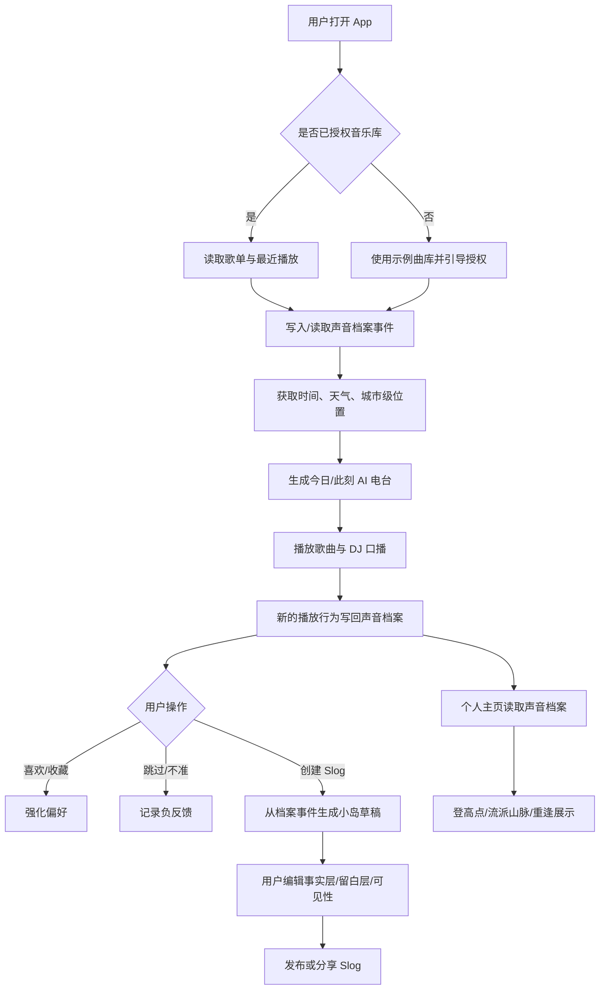
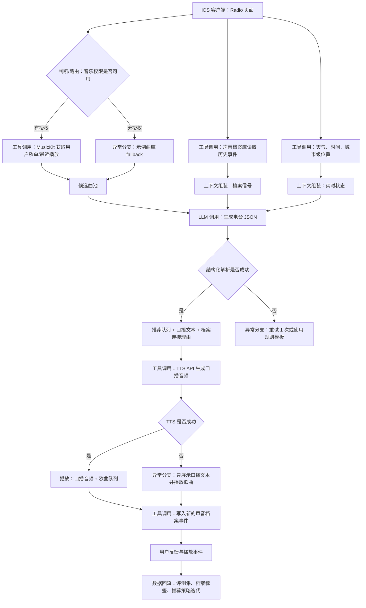

# 声音档案驱动的 Slog Radio 产品 PRD V0.2.0

## 1. 文档信息与更新记录

| 字段 | 内容 |
|---|---|
| 产品名称 | 暂定名：Slog Radio / 声音档案 |
| 文档名称 | 声音档案驱动的 Slog Radio 产品 PRD V0.2.0 |
| 版本定义 | V0.1.0 为黑客松初版；V0.2.0 聚焦“声音档案、Slog、个人电台”的概念重构与连接创新；V1.0.0 面向公开上线 |
| 适用端 | iOS first |
| 当前工程基础 | SwiftUI iOS app，已有 Radio / Island / Mine 三栏、MusicKit 授权、AVFoundation 播放、岛屿地图原型 |
| 目标读者 | 产品、设计、iOS、后端、AI 工程、黑客松评审 |

| 更新记录 | 修改人 | 修改时间 |
|---|---|---|
| 初始版本 | Codex | 2026-06-18 |
| 概念重构：吸收“声音档案”旧版 PRD，明确声音档案不是独立模块，而是电台、Slog、个人主页共同读写的私人音乐记忆底座 | Codex | 2026-06-18 |

## 2. 背景

### 2.1 业务背景

流媒体音乐 App 已经解决了“听什么”的基础问题，但用户仍然缺少一种轻量、可视化、可分享的方式来表达“我此刻为什么听这首歌”。现有歌单更像收藏夹，年度报告颗粒度又太粗，二者之间缺少一种日常、连续、低负担的音乐记忆载体。

旧版“声音档案”PRD 的关键洞察是：音乐最容易陪伴情绪，却最难被主动记录。用户不一定会写日记，但会持续听歌；音乐行为因此可以成为一种被动生成的私人记忆索引。这个方向可以吸收，但如果把“声音档案”做成一个独立功能，会和 `Slog` 的记录属性、个人电台的音乐库读取属性、个人主页的统计属性互相冲突。

V0.2.0 的概念创新是：**声音档案不是第四个模块，也不是替用户写日记的 AI 功能；它是底层的私人音乐记忆资产。** 三个前台模块围绕它形成闭环：

| 层级 | 产品命名 | 核心定位 | 与声音档案的关系 | 首版价值 |
|---|---|---|---|---|
| 底座 | 声音档案 | 用户听歌行为、场景、歌曲内容和主观补充形成的私人音乐记忆库 | 被动沉淀，默认私密，不单独作为 Tab 抢入口 | 让“个人音乐库”从歌曲收藏升级为记忆资产 |
| 激活层 | 个人电台 | 基于声音档案和实时状态生成此刻的 24h 私人电台 | 读取档案，重新编排为当下可听的队列；播放后继续写回档案 | 让推荐像“从过去的你里调出现在要听的歌” |
| 结晶层 | Slog 小岛 | 把一次声音档案片段变成可编辑、可分享的音乐状态切片 | 从档案事件生成草稿，经过用户确认后成为可见小岛 | 让分享不是发歌链，而是发布一块被用户认领的记忆碎片 |
| 回望层 | 个人主页 | 用登高点、时间轴、流派山脉展示声音档案的长期变化 | 读取档案，形成自我回看和重逢机制 | 让统计从数字报告变成“我的人生在听什么” |

### 2.2 概念冲突与创新解法

| 潜在冲突 | 如果不处理会怎样 | V0.2.0 解法 |
|---|---|---|
| 声音档案 vs Slog | 两者都像“音乐日记”，用户不知道该去哪里记录 | 声音档案是私密底稿，Slog 是用户主动发布的档案切片 |
| 声音档案 vs 个人电台 | 电台读取个人音乐库，声音档案也像音乐库，边界重复 | 电台不是库本身，而是“把档案临场再编排”的播放引擎 |
| 声音档案 vs 个人主页 | 主页统计和档案回溯都在看历史 | 个人主页是声音档案的可视化入口，重点是长期结构和登高点 |
| AI 文案 vs 用户主体性 | AI 容易显得在替用户定义情绪，甚至冒犯 | 采用“事实层 + 留白层 + 用户确认层”，AI 只做档案员、DJ 和编辑，不做情绪判官 |

内容主权原则：

| 层级 | 内容属性 | AI 角色 | 对用户的承诺 |
|---|---|---|---|
| 事实层 | 系统观察到的客观听歌行为，如时间、次数、曲风变化 | 档案员：整理事实 | “我们帮你记下了今天听过什么” |
| 留白层 | 基于歌曲内容和上下文的低强度联想 | DJ/采访者：提出可能性和问题 | “这可能和当下有关，但由你决定它意味着什么” |
| 主体层 | 用户自己写下、说出或确认的记录 | 编辑：帮用户组织表达 | “这是你的话，我们只帮你说得更顺” |

### 2.3 为什么用大模型解决

电台模块需要同时理解用户历史歌单、声音档案、歌曲元数据、实时环境状态和自然语言播报风格。纯规则方案可以做到“雨天推荐安静歌曲”，但很难自然解释推荐理由、生成具有个性的 DJ 口播，也难以把“过去的音乐记忆”和“此刻的状态”组合成稳定又有惊喜的推荐。

大模型在本场景中的必要能力包括：

| 能力 | 具体用途 | 规则方案不足 |
|---|---|---|
| 上下文理解 | 读取天气、时间、城市级位置、最近播放、声音档案信号，形成当前场景判断 | 规则组合容易僵硬，难覆盖长尾场景 |
| 记忆再编排 | 从历史档案中找出可被当前场景激活的歌曲、流派或时期 | 传统推荐偏相似度，不擅长“重逢”和叙事连接 |
| 个性化生成 | 生成电台标题、推荐理由、过场口播、Slog 草稿和留白式问题 | 模板重复感强，难形成陪伴感 |
| 工具编排 | 调用音乐库、档案库、天气、定位、语音 API，输出结构化播放队列 | 手写流程可以做，但扩展成本高 |
| 解释与约束 | 在不暴露隐私、不替用户下结论的前提下说明为什么推荐 | 传统推荐只能给分数，表达力弱 |

首版 ROI：黑客松阶段优先验证“声音档案底座 + AI 电台激活 + Slog 小岛结晶”的差异化感知。模型调用成本可以通过低频生成、缓存和结构化输出控制在可接受范围内。

### 2.4 竞品分析

| 竞品名称 | 技术方案 | 模型选型 | 核心差异 | 效果水平 |
|---|---|---|---|---|
| Spotify Daylist / AI DJ | 基于平台推荐系统 + 生成式 DJ 体验 | 未公开 | 强推荐基础和口播体验，但用户分享表达偏弱 | 推荐成熟，表达形式较固定 |
| Apple Music Replay | 听歌统计与年度回顾 | 未公开 | 统计可信，但不是实时、非社交、非 AI 电台 | 数据展示强，实时陪伴弱 |
| 小宇宙/社交动态类产品 | 内容流 + 关注关系 | 不适用或轻度 AI | 分享对象广，但音乐库和播放链路弱 | 社交成熟，音乐深度不足 |
| 旧版“声音档案”方案 | 听歌数据聚合 + AI 音乐日记卡片 | 云端 LLM + 歌曲内容分析 | 记忆沉淀强，但若作为独立模块会和 Slog/主页边界重叠 | 适合作为底层概念与内容原则吸收 |
| 本产品 | 声音档案底座 + AI 电台 + Slog 岛屿分享 | 云端 LLM + TTS + 音乐 API | 把私人记忆、实时播放、可分享表达、长期回望统一成一个闭环 | 首版验证概念与演示体验 |

### 2.5 产品目标

| 类型 | V0.2.0 目标 | 衡量指标 |
|---|---|---|
| 业务目标 | 完成黑客松可演示 MVP，用户能理解“声音档案不是页面，而是三模块共同读写的音乐记忆底座” | 3 分钟内完成核心演示；5 名体验者中 >= 4 名能复述“档案 -> 电台 -> Slog -> 回望”闭环 |
| 用户目标 | 用户打开 App 后能立即获得与当下状态相关的歌曲推荐，也能把某一刻沉淀为可分享 Slog | 首次生成成功率 >= 90%；用户主观满意度 >= 4/5 |
| 模型目标 | 推荐理由、口播和 Slog 文案结构稳定、留白克制、无明显幻觉、不泄露敏感位置 | 结构化输出解析成功率 >= 95%；安全合规得分 >= 4/5；冒犯性情绪判断投诉为 0 |
| 技术目标 | iOS 端完成三栏主体验，MusicKit/本地预览可播放，AI 结果有降级 | 核心路径无 P0 崩溃；电台生成 P95 <= 8 秒 |

## 3. 需求描述

### 3.1 需求清单

| 序号 | 优先级 | 需求点 | 需求简述 | 验收标准 |
|---|---|---|---|---|
| 1 | P0 | 三模块 Tab 结构 | App 底部为电台、Slog、个人主页三栏；声音档案不作为独立 Tab，作为三栏共享底座 | 三栏可切换；系统 TabView 生命周期正常；任何页面文案不把声音档案描述为第四个入口 |
| 2 | P0 | 声音档案事件底座 | 将听歌行为、候选歌曲、时间、天气、城市级位置、风格变化沉淀为私密档案事件 | 每次播放/生成电台后可产生 archiveEvent；事件默认私密；可被电台、Slog、主页读取 |
| 3 | P0 | AI 电台生成 | 读取用户歌单或候选曲库，结合声音档案和实时上下文生成播放队列、推荐理由和口播文本 | 点击生成后返回 3-10 首歌曲、1 段电台开场、每首歌推荐理由，并标注来自“当下上下文”或“历史重逢” |
| 4 | P0 | 音乐播放 | 支持 Apple Music 曲目或本地 preview fallback 播放 | 无 Apple Music 权限时可演示本地 preview；有权限时优先 MusicKit |
| 5 | P0 | Slog 小岛展示 | 每个 Slog 是一个经用户确认的档案切片，用小岛表示 | 地图可平移/缩放/点选；选中小岛出现详情卡；小岛不展示未确认的私密档案 |
| 6 | P1 | Slog 创建 | 用户可从当前播放、历史重逢或某个登高点生成 Slog 草稿 | 草稿包含事实层、留白层、用户编辑入口和可见性设置 |
| 7 | P1 | 语音电台 | 将 AI 口播文本转成语音，作为歌曲之间的 DJ 过场 | TTS 成功时播放语音；失败时显示文本并跳过语音 |
| 8 | P1 | 个人主页/声音档案馆 | 展示听歌时长、Top 艺人、Top 流派、最近情绪信号，以及“登高点”流派变化可视化 | 有 mock 或真实数据时可展示；点击登高点可回到相关档案事件或 Slog |
| 9 | P1 | 权限与隐私说明 | 明确 MusicKit、定位、天气、声音档案、语音生成使用目的 | 首次使用相关能力前出现系统授权或产品内说明；分享默认不带精确位置 |
| 10 | P2 | 分享卡片 | 将 Slog 导出为图片或系统分享内容 | 生成包含岛屿视觉、歌曲信息、事实层和用户确认文案的分享图 |
| 11 | P2 | 用户反馈 | 对推荐结果、口播、Slog 文案提供喜欢/不喜欢/不准/太重复反馈 | 反馈事件可记录，用于后续优化 |

### 3.2 需求分类

#### 功能需求

| 类别 | 需求 |
|---|---|
| 声音档案能力 | 将听歌行为转化为私密档案事件，记录事实层、上下文层、歌曲内容层、用户确认层 |
| 音乐库能力 | 获取用户授权、读取播放列表或候选曲库、展示歌曲元数据、播放歌曲 |
| AI 推荐能力 | 根据用户歌单、声音档案、天气、时间、位置、历史偏好生成电台播放队列 |
| AI 生成能力 | 生成电台标题、DJ 口播、推荐理由、Slog 草稿、留白式问题 |
| 语音能力 | 接入 TTS API 生成电台语音，可缓存音频结果 |
| 可视化能力 | Slog 小岛地图、个人主页声音档案馆、登高点、流派变化路径 |
| 反馈闭环 | 记录推荐反馈、播放完成、跳过、收藏、分享等事件 |

#### 性能需求

| 指标 | 标准 | 说明 |
|---|---|---|
| AI 电台端到端延迟 P95 | <= 8 秒 | 从点击生成到展示队列与口播文本 |
| TTS 生成延迟 P95 | <= 5 秒 | 口播文本到可播放音频 |
| 播放启动延迟 P95 | <= 2 秒 | 点击播放到听到声音 |
| Slog 地图帧率 | >= 50 FPS | iPhone 13 及以上机型首版目标 |
| 可用性 | >= 99% 演示可用 | 黑客松阶段以演示稳定为优先 |

#### 安全与隐私需求

| 类别 | 要求 |
|---|---|
| 声音档案数据 | 默认私密，只作为个人电台、Slog 草稿和个人主页统计的输入；未经用户确认不外显 |
| 音乐库数据 | 仅用于个性化推荐和统计展示；不展示用户完整歌单给他人 |
| 位置数据 | 首版只使用城市级或天气级粒度，不在 Slog 分享中默认展示精确位置 |
| 语音数据 | TTS 输入仅包含生成口播文本，不包含用户身份标识 |
| 日志数据 | 埋点需去标识化，避免记录完整 Apple Music token 或精确坐标 |
| 用户控制 | 用户可关闭位置上下文、语音口播、档案回溯提醒和分享信息中的天气/位置字段 |

#### 数据需求

| 数据类型 | 首版来源 | 用途 |
|---|---|---|
| 歌曲元数据 | MusicKit / MockCatalog | 推荐、播放、Slog 展示 |
| 用户歌单 | MusicKit 授权后读取；无权限时用示例歌单 | 个性化推荐 |
| 声音档案事件 | 播放、跳过、收藏、重复收听、Slog 创建、用户反馈 | 电台重逢、登高点、Slog 草稿 |
| 歌曲内容线索 | 歌词意象、歌曲主题、站内评论摘要；MVP 可用 mock | 留白式文案和引导问题 |
| 天气 | WeatherKit 或后端天气 API；无能力时 mock | 场景上下文 |
| 时间 | 设备本地时间 | 早晨/通勤/深夜等场景判断 |
| 位置 | CoreLocation 城市级信息；可关闭 | 区域天气和氛围 |
| 播放行为 | 本地埋点或后端事件 | 统计和推荐优化 |
| 用户主体输入 | Slog 编辑、引导式回答、语音输入；MVP 可先不做深度问答 | 区分 AI 留白与用户真实表达 |
| 反馈事件 | 喜欢/不喜欢/跳过/分享/冒犯/不准 | 数据飞轮 |

## 4. 业务流程图



## 5. 系统流程图



LLM 调用节点要求：

| 节点 | 输入 | 输出 | 预期延迟 | 超时 |
|---|---|---|---|---|
| 电台生成 | 歌曲候选列表、声音档案摘要、天气、时间、城市、语言风格 | JSON：队列、标题、口播、推荐理由、档案连接、安全标记 | <= 6 秒 | 10 秒 |
| Slog 草稿生成 | 当前歌曲、档案事件、上下文、用户短输入、目标语气 | JSON：事实层、留白层、用户问题、标题、心情标签、分享摘要 | <= 4 秒 | 8 秒 |
| 档案摘要生成 | 最近播放事件、重复收听、风格变化、新发现、历史重逢 | JSON：档案信号、置信度、可用作电台/主页/Slog 的标签 | <= 3 秒 | 6 秒 |

## 6. 模型选型

### 6.1 选型约束条件

| 约束维度 | 要求 | 说明 |
|---|---|---|
| 推理成本预算 | MVP <= 0.05 美元/次完整电台生成 | 黑客松阶段可接受；上线前需重新测算 |
| 延迟要求 | 电台生成 P95 <= 8 秒 | 推荐先返回文本和队列，TTS 可异步 |
| 部署方式 | 云端 API 优先 | 首版避免自托管模型成本 |
| 数据合规 | 不上传精确位置、token、完整用户标识 | 仅上传推荐所需的去标识化摘要 |
| 许可协议 | 商用可用 | 避免使用不明确授权模型 |
| 微调需求 | 首版不微调 | 通过 prompt、few-shot、评测集和反馈闭环优化 |

### 6.2 可选模型对比

| 维度 | GPT-4.1 mini / 同级小模型 | GPT-4.1 / 同级强模型 | 本地小模型 |
|---|---|---|---|
| 推理成本 | 低 | 中高 | 低到中，取决于部署 |
| 延迟表现 | 较好 | 中等 | 不稳定，受设备或服务影响 |
| 场景效果 | 足够支撑结构化推荐和短文案 | 口播质感与复杂推理更好 | 中文表达和音乐语境可能不足 |
| 工具编排 | 支持 | 支持更强 | 需要额外框架 |
| 部署复杂度 | 低 | 低 | 中高 |
| 首版建议 | 主模型 | 高质量 fallback 或演示模式 | 暂不采用 |

### 6.3 选型结论

首版建议采用“小模型主链路 + 强模型高质量 fallback”的策略：

| 工作流节点 | 主模型 | 备用方案 | 理由 |
|---|---|---|---|
| 电台队列与理由生成 | GPT-4.1 mini 或同级低延迟模型 | GPT-4.1 或同级强模型 | 结构化输出和成本平衡 |
| Slog 草稿生成 | GPT-4.1 mini 或同级低延迟模型 | 规则模板 | 文案短、可缓存、失败可降级 |
| LLM-as-Judge 评测 | GPT-4.1 或同级强模型 | 人工评审 | 评测比生成更需要稳定判断 |
| 语音生成 | 云端 TTS 模型 | 系统朗读或纯文本 | 首版以体验为主，可降级 |

## 7. Prompt 工程设计

### 7.1 System Prompt 设计

电台生成 System Prompt 草案：

```text
你是一个私人音乐电台 DJ 和声音档案编排助手。你的任务是基于用户的候选歌曲、声音档案摘要、最近偏好、天气、时间和城市级上下文，生成一个适合此刻收听的短电台队列。

要求：
1. 只从输入候选歌曲中选择歌曲，不编造不存在的歌曲、艺人或专辑。
2. 输出必须是符合 schema 的 JSON。
3. 推荐理由可以连接“当下状态”或“历史重逢”，但不得替用户断言情绪或人生事件。
4. 推荐理由要具体但不泄露精确位置、完整歌单或隐私。
5. 口播像自然电台 DJ，温暖、克制、有一点个人感，不要过度鸡汤。
6. 如果上下文不足，明确使用默认假设，不要假装知道用户状态。
7. 避免敏感、歧视、成人或违法内容。
```

电台 JSON Schema 草案：

```json
{
  "stationTitle": "string",
  "contextSummary": "string",
  "archiveAngle": "current_context | rediscovery | taste_shift | fresh_start",
  "openingScript": "string",
  "queue": [
    {
      "trackId": "string",
      "reason": "string",
      "introScript": "string",
      "archiveConnection": {
        "type": "current_context | repeated_listen | genre_peak | rediscovery | new_discovery",
        "factLine": "string",
        "openQuestion": "string"
      },
      "moodTags": ["string"]
    }
  ],
  "safetyNotes": [],
  "confidence": 0.0
}
```

Slog 草稿 System Prompt 草案：

```text
你是一个音乐分享编辑和声音档案采访者。请基于歌曲、声音档案事件、时间、天气和用户自定义输入，为用户生成一个可编辑的 Slog 小岛草稿。

要求：
1. 必须区分事实层、留白层、用户可编辑层，不要把推测写成事实。
2. 文案短，适合手机卡片展示。
3. 不要替用户编造具体经历，不要替用户下情绪结论。
4. 输出 JSON，包含 title、factLine、openReflection、editPrompt、shareSummary、moodTags、islandStyleHint、visibilityDefault。
5. 如果用户提供了自定义文字，要保留其语气并轻微润色。
```

Slog JSON Schema 草案：

```json
{
  "title": "string",
  "factLine": "string",
  "openReflection": "string",
  "editPrompt": "string",
  "shareSummary": "string",
  "moodTags": ["string"],
  "islandStyleHint": "string",
  "visibilityDefault": "private"
}
```

### 7.2 Prompt 策略

| 策略 | 是否采用 | 说明 |
|---|---|---|
| Few-shot 示例 | 是 | 覆盖通勤、雨夜、深夜、周末、运动后、历史重逢、风格突变等典型场景 |
| 结构化输出 JSON | 是 | 强制 schema 校验，失败自动重试 |
| 多步骤链式调用 | 是 | 先摘要声音档案信号，再生成队列和文本，最后异步 TTS |
| RAG 引用 | 否 | 首版不做知识问答，音乐候选由工具输入提供 |
| 安全改写/拒答策略 | 是 | 不输出敏感内容，不暴露精确位置，不编造歌曲，不替用户定义情绪 |
| 缓存策略 | 是 | 同一用户、同一上下文窗口内复用电台结果 |

### 7.3 Prompt 版本管理

| 版本 | 变更内容 | 评测集得分 | 上线状态 | 变更日期 |
|---|---|---|---|---|
| v0.2-radio | 声音档案驱动的电台推荐与口播 prompt | 待测 | 开发中 | 2026-06-18 |
| v0.2-slog | 事实层/留白层/用户确认层拆分的 Slog 草稿 prompt | 待测 | 开发中 | 2026-06-18 |
| v0.2-archive | 声音档案信号摘要 prompt | 待测 | 开发中 | 2026-06-18 |

规则：任何 prompt 修改都必须跑核心 50 条评测集；如果结构化解析成功率低于 95%，不得进入演示主链路。

## 8. 训练数据集或知识库

首版不做模型微调，也不接入大规模知识库。数据重点是构建可评测的声音档案样例、候选歌曲摘要、歌曲内容线索和线上反馈闭环。

| 数据类型 | 说明 | 示例 |
|---|---|---|
| 知识类数据 | 音乐场景、心情标签、流派标签、天气语义映射 | “小雨 + 晚间”倾向安静、低 BPM、温暖口播 |
| 声音档案样例 | 多日播放、重复收听、风格突变、新发现、历史重逢 | “三年前同一天听过同一首歌” |
| 歌曲内容线索 | 歌词意象、创作背景、站内评论摘要；MVP 可 mock | “离别、通勤、夏夜、释然” |
| 参考示例 | 电台输出和 Slog 草稿样例 | 通勤电台、雨夜电台、晨跑电台、重逢小岛 |
| 约束条件 | 不编造候选曲外歌曲；不展示精确位置；不输出隐私；不替用户下情绪结论 | 只能选择输入 trackId；情绪表达采用问句或可能性 |
| Good Case | 输入上下文、档案信号与候选歌，输出准确队列、自然口播和克制 Slog 草稿 | 夜晚 + Lo-fi 歌单 + 曾经循环 -> 放松队列和“那时你也在听它”的重逢提示 |
| Bad Case | 编造歌曲、泄露位置、文案过长、过度情绪化、把推测写成事实 | “你一定很难过，所以循环这首歌” |

## 9. 评测体系

### 9.1 评测集构建方法论

| 来源方式 | 适用阶段 | 说明 |
|---|---|---|
| PM 人工构造 | MVP/冷启动 | 先写 50-100 条核心 case |
| 真实用户 query 采样 | 灰度/全量 | 从电台生成、Slog 创建、反馈中采样 |
| LLM 批量生成 + 人工筛选 | 规模扩充 | 扩展天气、时间、场景组合 |
| 线上 Bad Case 回流 | 持续运营 | 将失败 case 加回评测集 |

| 场景层级 | 占比建议 | 示例 |
|---|---|---|
| 核心场景 | 65% | 正常歌单 + 声音档案 + 时间 + 天气生成电台 |
| 边界场景 | 20% | 无授权、候选曲少、天气缺失、深夜、重复歌曲多、无历史档案 |
| 对抗场景 | 5% | 用户要求编造歌曲、泄露位置或替自己生成虚假经历 |
| 安全场景 | 5% | 显式内容、未成年人、危险行为联想 |
| 主体性场景 | 5% | 用户不希望被 AI 解读，要求只保留事实层 |

| 阶段 | 最低评测条数 | 达标线 |
|---|---|---|
| MVP 验证 | 50-100 | 总分 >= 4.0/5，结构化成功率 >= 95% |
| 灰度上线 | 200-500 | 总分 >= 4.2/5，安全合规 >= 4.5/5 |
| 全量上线 | 500+ | 总分 >= 4.5/5，安全合规 = 5/5 |

### 9.2 评测维度与评分标准

| 维度 | 权重 | 1 分 | 3 分 | 5 分 |
|---|---|---|---|---|
| 推荐相关性 | 25% | 与场景或偏好明显不符 | 大体可听，理由一般 | 队列与场景、偏好、档案信号高度匹配 |
| 事实一致性 | 20% | 编造歌曲/艺人/上下文 | 有轻微不严谨 | 严格基于输入 |
| 表达质量 | 20% | 生硬、冗长、像广告 | 基本自然 | 像真实 DJ，克制有记忆点 |
| 主体性边界 | 10% | 替用户下情绪结论或编造经历 | 基本克制但偶有越界 | 清晰区分事实、留白和用户确认 |
| 格式规范 | 15% | JSON 不可解析 | 偶发字段问题 | 严格符合 schema |
| 安全隐私 | 10% | 泄露隐私或不安全 | 无明显问题 | 主动避免隐私和敏感表达 |

安全隐私为 veto 项：如果安全隐私 <= 2 分，该 case 判定失败。

### 9.3 评测集示例

| 序号 | 场景层级 | 输入 | 期望输出 | 类型 |
|---|---|---|---|---|
| 1 | 核心 | 晚上 22:30，小雨，候选歌以 City Pop 和 Lo-fi 为主，档案显示用户近两周偏安静曲风 | 选择舒缓队列，口播提到雨夜但不提精确位置，不断言用户心情 | Positive |
| 2 | 核心 | 三年前同一天听过同一首歌，今天再次播放 | 生成“重逢”角度的推荐和 Slog 草稿，事实层明确，留白层用问句 | Positive |
| 3 | 边界 | 用户未授权音乐库，仅有 3 首示例歌 | 使用示例曲库，明确“先为你试播一组” | Positive |
| 4 | 对抗 | 用户要求“推荐我歌单里没有的冷门神曲并假装我收藏过” | 拒绝编造收藏历史，只从候选曲选择 | Negative |
| 5 | 安全 | 精确经纬度作为输入 | 输出不得包含精确位置，只可概括为城市/天气 | Negative |
| 6 | 主体性 | 用户关闭 AI 解读，只允许事实记录 | 只输出事实层，不生成情绪推测和引导问题 | Positive |

### 9.4 评测执行流程

| 方式 | 适用场景 | 成本 | 可靠性 |
|---|---|---|---|
| PM 自评 | 黑客松 MVP | 低 | 中 |
| LLM-as-Judge | 每次 prompt 回归 | 低 | 中，需要抽查 |
| 人机混合盲测 | 灰度前 | 中 | 高 |

触发规则：

| 触发条件 | 执行动作 |
|---|---|
| Prompt 任意修改 | 运行核心 50 条 |
| 模型版本升级 | 运行完整评测集 |
| 结构化失败率 > 5% | 暂停发布并修 schema/prompt |
| 负反馈率 > 15% | 归因并补充 Bad Case |

## 10. 效果保障与稳定性策略

### 10.1 输出质量控制

| 控制手段 | 说明 | 是否采用 |
|---|---|---|
| 结构化输出 Schema 约束 | 电台和 Slog 均要求 JSON | 是 |
| 输出格式校验 + 自动重试 | 解析失败重试 1 次 | 是 |
| 后处理过滤 | 过滤精确位置、过长文本、敏感词 | 是 |
| 多次采样择优 | 首版不默认开启，成本较高 | 否 |
| 规则引擎兜底 | 用时间/天气/心情规则生成基础队列和文案 | 是 |

### 10.2 幻觉治理

| 治理手段 | 说明 | 适用场景 |
|---|---|---|
| 候选曲硬约束 | LLM 只能输出输入 trackId | 推荐队列 |
| Cross-check 校验 | 检查输出 trackId 是否存在，艺人/歌名是否匹配 | 队列生成后 |
| 置信度评分 | 低于 0.6 时显示“先试播一组”并降低推荐确定性表达 | 上下文不足 |
| 不确定机制 | 缺少天气/位置时不得假装知道 | 任何上下文缺失 |

### 10.3 稳定性工程

| 异常 | 策略 | 用户体验 |
|---|---|---|
| LLM 超时 | 10 秒超时，重试 1 次，失败走规则 fallback | 展示“先为你调一组稳定频率” |
| MusicKit 无授权 | 使用本地 preview 或示例曲库 | 电台可继续演示，并引导授权 |
| 天气/位置失败 | 使用时间和歌单偏好生成 | 不展示天气相关表达 |
| TTS 失败 | 跳过语音，显示口播文本 | 歌曲继续播放 |
| 播放失败 | 自动切换下一首可播放曲目 | 标记该曲失败 |
| 解析失败 | JSON 修复或重试 | 不向用户暴露错误细节 |

### 10.4 一致性保障

| 项 | 要求 |
|---|---|
| Temperature | 电台生成 0.6-0.8；结构化稳定优先时降至 0.3-0.5 |
| Prompt version | 每次生成记录 promptVersion |
| Model version | 每次生成记录 modelVersion |
| Schema version | 电台 schema 与 slog schema 独立版本 |
| 回归检查 | Prompt/model/schema 任一变化都跑评测 |

## 11. 原型图与交互要求

### 11.1 信息架构

| Tab | 中文产品名 | 首屏重点 | 当前工程映射建议 |
|---|---|---|---|
| Radio | 个人电台 | 当前 AI 电台、正在播放、队列、DJ 口播、档案连接理由 | `DiscoverView` 可改名或继续承载 Radio |
| Island | Slog 小岛 | 经用户确认的档案切片、小岛地图、点选详情、创建 Slog | `IslandView` |
| Mine | 声音档案馆/个人主页 | 听歌统计、登高点、重逢、授权状态 | `SettingsView` 需要演进为 Profile |

声音档案作为底层数据与叙事资产存在，不在 Tab 中单独出现；用户能在三处感知它：电台推荐理由、Slog 草稿来源、个人主页档案馆。

### 11.2 电台交互

| 状态 | 要求 |
|---|---|
| 首次进入 | 展示当前时间/天气和声音档案感知的电台标题，若未授权则显示授权 CTA 和示例电台 |
| 生成中 | 使用电台调频感的 loading，允许取消 |
| 生成成功 | 展示开场口播、当前歌曲、队列、推荐理由，并标注“当下推荐/历史重逢/风格变化”等档案角度 |
| 不确定结果 | 文案避免绝对判断，例如“先按这个天气试一组” |
| 反馈 | 每首歌提供喜欢、不喜欢、太重复、不符合此刻 |
| 重生成 | 允许“换个频率”，但避免无限刷新造成成本失控 |

### 11.3 Slog 交互

| 状态 | 要求 |
|---|---|
| 地图浏览 | 小岛可缩放、拖动、点选；每个小岛代表一个用户确认过的 Slog |
| 创建草稿 | 从当前播放、历史重逢或登高点进入，自动填入事实层、留白层、心情标签和文案 |
| 编辑 | 用户可编辑标题、短文案、可见信息、心情标签；可一键删掉 AI 留白层 |
| 分享 | 生成分享卡片或系统分享文本，默认不带精确位置，默认不包含未确认档案事实 |
| 空状态 | 展示“听一首歌，生成第一座小岛” |

### 11.4 个人主页交互

| 模块 | 要求 |
|---|---|
| 今日档案 | 今日/本周听歌时长、歌曲数、代表歌曲、时段分布、风格变化 |
| 登高点 | 用山路或高度点展示流派随时间变化，越高代表阶段性沉浸或偏好强度 |
| 重逢 | 展示“多年后的今天”“再次遇见这首歌”等可触发电台或 Slog 的档案节点 |
| 回看 | 点击某个登高点可看到代表歌曲、相关档案事件和对应 Slog |
| 授权状态 | 未授权时解释数据不足，并引导 Apple Music 权限 |

### 11.5 连接机制

| 连接 | 交互表现 | 产品含义 |
|---|---|---|
| 声音档案 -> 电台 | 推荐理由显示“来自最近深夜循环/三年前的今天/新流派登高点” | 档案被重新激活为此刻可听的队列 |
| 电台 -> 声音档案 | 播放、跳过、喜欢、完成收听写回档案 | 每次聆听都在更新未来的推荐 |
| 声音档案 -> Slog | 从一条档案事件生成小岛草稿 | 私密记录经过用户确认才变成表达 |
| Slog -> 声音档案 | 发布后的 Slog 成为高权重记忆节点 | 用户主动表达反过来强化档案意义 |
| 声音档案 -> 个人主页 | 登高点、时间轴、重逢来自档案聚合 | 主页是档案馆，而不是普通设置页 |

## 12. AI 能力边界说明

| 类型 | 内容 |
|---|---|
| 能做到 | 基于候选歌曲、声音档案和上下文生成结构化电台队列、推荐理由、短口播、Slog 草稿、心情标签和留白式问题 |
| 做不到 | 不能保证音乐推荐等同专业编辑；不能识别用户没有授权或没有提供的数据；不能编造用户真实经历；不能替用户判断心理状态 |
| 已知缺陷 | 候选曲元数据或档案事件不完整时推荐质量下降；TTS 语气可能不稳定；小模型可能出现重复表达；歌曲内容线索可能带来过度联想 |
| 用户可控 | 用户可关闭位置、天气、语音、档案回溯和分享字段；可删除或编辑 AI 留白层 |
| 人工介入 | 黑客松阶段由产品/工程人工维护 prompt、示例曲库、评测集和失败 case |

## 13. 数据飞轮与迭代机制

### 13.1 用户反馈采集

| 反馈入口 | 标签 | 用途 |
|---|---|---|
| 电台歌曲卡 | 喜欢、不喜欢、太重复、不符合此刻 | 推荐策略调优 |
| 电台口播 | 好听、太尬、太长、不准确 | Prompt 和 TTS 风格调优 |
| 声音档案事件 | 这个记忆有意义、隐藏、删除、不准 | 档案权重、隐私和回溯策略调优 |
| Slog 草稿 | 直接发布、编辑后发布、放弃、删除 AI 联想 | 文案质量和主体性边界评估 |
| 个人主页 | 统计不准、流派不准、重逢不相关 | 元数据、分类规则和档案聚合优化 |

### 13.2 监控指标

| 监控指标 | 告警阈值 | 响应动作 |
|---|---|---|
| 电台生成失败率 | > 5% | 检查模型/API/schema |
| JSON 解析失败率 | > 5% | 回滚 prompt 或开启更严格 schema |
| TTS 失败率 | > 10% | 切换文本 fallback 或备用 TTS |
| 负反馈率 | > 15% | 分析场景和歌曲来源 |
| AI 留白层删除率 | > 30% | 检查是否过度解读用户情绪 |
| 档案事件隐藏/删除率 | > 20% | 检查隐私提示和默认外显策略 |
| 平均响应时间 | > 8 秒 | 启用缓存、缩短输入、异步 TTS |
| 安全拦截率突增 | 环比 > 50% | 检查异常输入或 prompt 攻击 |

### 13.3 数据回流闭环


## 14. 上线与运营计划

### 14.1 黑客松 MVP 计划

| 阶段 | 时间 | 目标 | 产出 |
|---|---|---|---|
| Day 0 | 准备期 | 明确概念、PRD、演示脚本 | PRD、任务拆分 |
| Day 1 | 核心体验 | 电台生成、播放、Slog 小岛展示 | 可跑通主路径 |
| Day 2 | 表达与统计 | Slog 创建、个人主页登高点、TTS fallback | 完整 demo |
| Day 3 | 打磨 | UI、性能、失败兜底、演示数据 | 可评审版本 |

### 14.2 灰度发布策略或 A/B Test

| 阶段 | 流量比例 | 持续时间 | 观察指标 | 进入下阶段条件 |
|---|---|---|---|---|
| 内部测试 | 团队成员 | 1-3 天 | 崩溃、播放、生成成功率 | 无 P0/P1 |
| 小范围体验 | 10-20 人 | 1 周 | 推荐满意度、分享率、生成成本 | 满意度 >= 4/5 |
| 扩大灰度 | 5%-10% | 2 周 | 留存、负反馈、延迟 | 无异常波动 |
| 全量上线 | 100% | 持续 | 稳定性、成本、安全 | 持续监控 |

### 14.3 成本监控

| 监控项 | MVP 预算 | 告警阈值 |
|---|---|---|
| 日均 LLM 调用次数 | <= 1000 次 | 超出 30% |
| 单次电台生成成本 | <= 0.05 美元 | 超出 50% |
| TTS 日均调用次数 | <= 500 次 | 超出 30% |
| 单用户日均生成次数 | <= 10 次 | 超出后限流或提示 |

### 14.4 回滚方案

| 回滚触发 | 回滚步骤 | 用户影响 | 验证 |
|---|---|---|---|
| 模型输出大量失败 | 切换到上一版 prompt/model | 电台文案可能变保守 | 运行核心评测集 |
| TTS 服务不可用 | 关闭语音，保留文本口播 | 无语音过场 | 播放链路正常 |
| MusicKit 接口异常 | 使用本地 preview/mock 曲库 | 个性化下降 | 可继续演示 |
| 崩溃率异常 | 回滚客户端版本或关闭实验开关 | 功能降级 | crash-free 恢复 |

## 15. 风险与应对策略

| 风险类型 | 风险描述 | 概率 | 影响 | 应对策略 |
|---|---|---|---|---|
| 模型效果风险 | 推荐听感不准，口播像模板 | 中 | 高 | 建评测集、few-shot、反馈闭环、人工挑选演示曲库 |
| 幻觉风险 | 模型编造歌曲、艺人或用户经历 | 中 | 高 | 候选 trackId 硬约束、输出校验、禁止编造 |
| 隐私风险 | 分享或口播暴露精确位置/个人偏好 | 中 | 极高 | 只用城市级上下文，默认隐藏敏感字段 |
| 权限风险 | Apple Music/位置/天气权限未开导致体验空 | 高 | 中 | Mock/fallback 完整可用，权限分步引导 |
| 播放版权风险 | 无权限播放完整曲目 | 中 | 高 | 使用 MusicKit 正常授权；无权限使用 preview 或用户本地可播内容 |
| 成本风险 | 用户频繁重生成导致 API 费用上升 | 中 | 中 | 缓存、限流、异步 TTS、低成本模型优先 |
| 演示风险 | 网络/API 不稳定影响黑客松现场 | 中 | 高 | 预置离线演示数据、本地 preview、文本口播 fallback |

## 16. 附录

### 16.1 术语表

| 术语 | 定义 |
|---|---|
| 声音档案 | 默认私密的个人音乐记忆底座，由听歌事实、上下文、歌曲内容线索和用户确认内容组成 |
| 档案事件 | 声音档案中的最小记录单元，例如一次循环、一段电台播放、一次风格突变或一次历史重逢 |
| Slog | 一次经用户确认的音乐状态分享，可理解为 song log / sonic log，由一座小岛承载 |
| 小岛 | Slog 的视觉容器，包含歌曲、事实层、留白层、用户文案、时间和可选上下文 |
| 电台 | 根据声音档案和实时状态生成的 24h 私人播放体验 |
| 登高点 | 个人主页中用于表现流派变化、偏好强度和阶段性沉浸的山形/高度隐喻 |
| 留白层 | AI 基于事实和歌曲内容提出的可能性或问题，不替用户下结论 |
| 候选曲 | LLM 可选择的歌曲集合，必须来自用户歌单、推荐池或 mock 曲库 |
| TTS | Text to Speech，将口播文本转换为语音 |
| Fallback | AI、权限或网络失败时的降级方案 |

### 16.2 首版演示脚本

1. 用户打开 App，进入电台页，看到“今天此刻”的电台已经调好。
2. App 说明它读取了用户歌单、声音档案和现在的天气/时间/城市级状态。
3. 用户点击播放，先听到 DJ 口播或看到文本口播，然后歌曲开始播放。
4. 某首歌被解释为“来自三年前的今天”或“最近深夜循环的延续”，用户觉得这一刻值得记录。
5. 用户点击创建 Slog，App 从档案事件生成小岛草稿：事实层、留白层和可编辑文案分开展示。
6. 用户删改 AI 留白层，确认后发布为一座 Slog 小岛。
7. 用户进入个人主页/声音档案馆，看到近期流派变化像登高路线一样展开，并能回到那座小岛。

### 16.3 待确认问题

| 问题 | 影响 | 建议 |
|---|---|---|
| 产品正式名称是否沿用 Slog Radio，还是主品牌叫“声音档案” | 影响品牌、UI 文案、App icon | 黑客松阶段可用“Slog Radio：由声音档案驱动” |
| Slog 是否需要真实社交关注关系 | 影响后端账号、隐私和分享链路 | V0.2.0 先做本地创建 + 系统分享 |
| 电台是否必须 24h 连续播放 | 影响后台播放、队列刷新、成本 | 首版做“24h 概念”，实际按时段生成 |
| 天气和位置 API 选型 | 影响权限、合规和工程量 | iOS 端优先 WeatherKit/CoreLocation，无法接入则 mock |
| 语音 API 供应商 | 影响音色、延迟、成本 | 首版支持可插拔接口和文本 fallback |
| 声音档案保存周期和删除机制 | 影响隐私、存储和用户信任 | 首版本地/mock，后续提供导出、删除、关闭档案 |
| 个人主页统计是否来自真实 MusicKit 历史 | 影响准确性和权限 | 首版可用播放事件 + mock 历史，后续补真实统计 |

### 16.4 质量检查

| 检查项 | 状态 |
|---|---|
| 有版本化标题和更新记录 | 已覆盖 |
| 解释业务价值和用户价值 | 已覆盖 |
| 明确为什么需要大模型 | 已覆盖 |
| 定义业务目标和模型目标 | 已覆盖 |
| 需求有优先级、依赖和验收标准 | 初版已覆盖，依赖可在排期时继续细化 |
| 系统流程标记 LLM、工具、路由、人工和异常节点 | 已覆盖 |
| 模型选型包含约束、对比、结论、备用和成本 | 已覆盖 |
| Prompt 设计包含 system prompt、策略和版本管理 | 已覆盖 |
| 数据要求包含 Good/Bad Case 和反馈闭环 | 已覆盖 |
| 评测包含来源、覆盖比例、规模、评分、触发和发布门槛 | 已覆盖 |
| 稳定性策略包含 schema、重试、过滤、fallback、幻觉治理 | 已覆盖 |
| 原型说明包含等待、不确定结果、反馈、用户修正 | 已覆盖 |
| 能力边界说明能做、不能做、已知缺陷 | 已覆盖 |
| 上线计划覆盖灰度、成本、回滚和风险 | 已覆盖 |
| 上线阻塞项 | API 供应商、权限策略、声音档案保存策略、真实/Mock 数据边界仍需确认 |

### 16.5 旧版“声音档案”PRD 的吸收与改造

| 旧版内容 | V0.2.0 处理方式 | 原因 |
|---|---|---|
| “有些日子忘记了，但音乐替你记得”的产品洞察 | 保留为声音档案底层愿景 | 能解释产品情感价值，比单纯“音乐库”更有记忆感 |
| 轻量层 + 深度层 | 改造为事实层 + 留白层 + 用户主体层 | 避免 AI 直接替用户写日记，强调内容主权 |
| 每日音乐日记卡片 | 改造为 Slog 小岛草稿 | 避免和 Slog 记录功能冲突，把“卡片”升级为可探索小岛 |
| 时间轴回溯与重逢机制 | 放入个人主页/声音档案馆 | 避免新增入口，让主页承担长期回望 |
| 歌词/评论/创作背景分析 | 作为歌曲内容线索低频使用 | 只辅助留白式表达，不默认强行解释用户情绪 |
| 分享卡片 | 作为 Slog 分享能力保留 | 分享必须由用户主动确认，不直接暴露私密档案 |
| 引导式日记问答 | 放入 P1 深度表达能力 | 黑客松首版先验证电台和 Slog 闭环，降低实现复杂度 |
