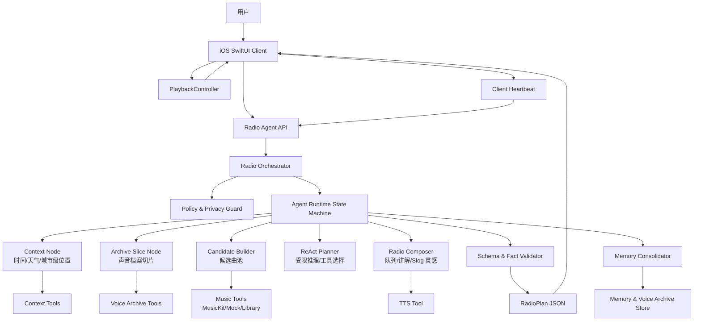
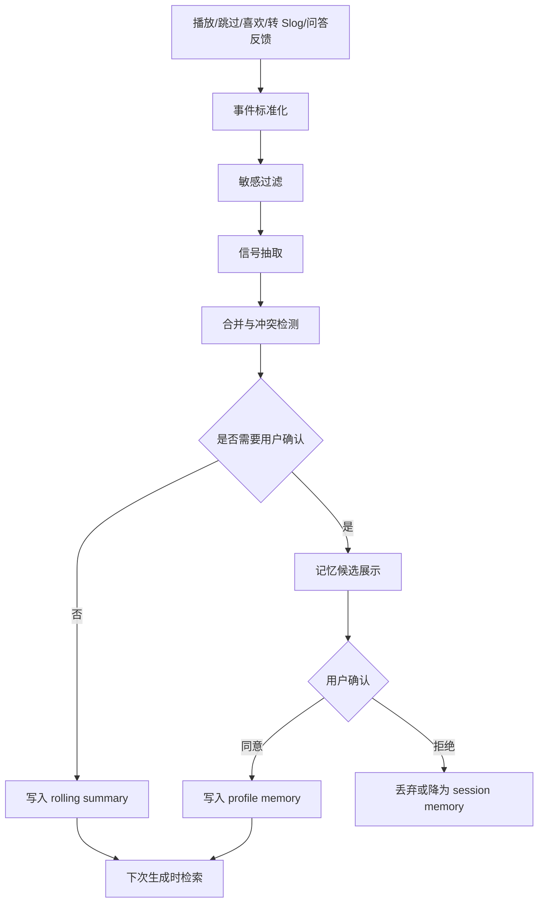
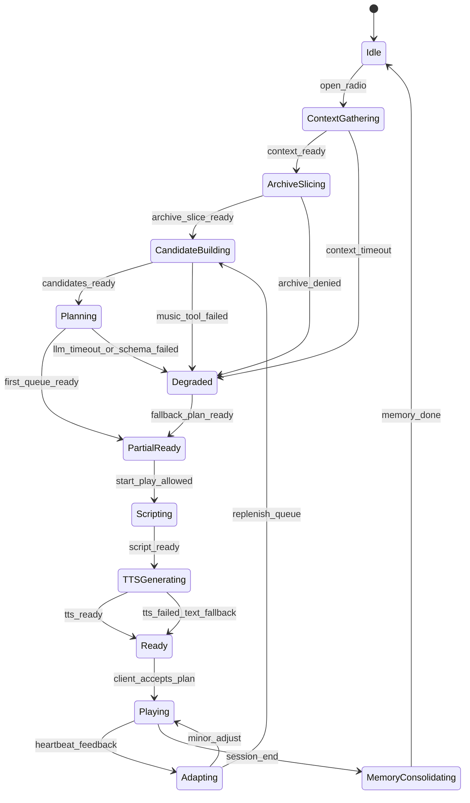

# Slog Radio 个人电台 Agent 架构设计

> 版本：V0.1  
> 日期：2026-06-19  
> 依据：`personal-music-slog-radio-prd-v0.4.6.md`，补充参考 `v0.2` 中更细的工程兜底策略

## 1. 设计目标

个人电台在 PRD V0.4.6 中不是独立主线，而是声音档案中的“自我收听 / 回放 / Slog 灵感”能力。Agent 架构必须服务这个产品边界：

- 从声音档案中调出“此刻适合重新听见的自己”，不是做泛化无限流推荐。
- 只从可播放候选歌曲中生成队列，不编造歌曲、艺人、专辑或用户经历。
- 生成结果可以提供 Slog 灵感，但必须由用户手动确认 1-5 首歌后才能转成 Slog 草稿。
- iOS 端继续负责播放执行，Agent 只返回结构化 `RadioPlan`、讲解脚本、Slog 灵感和可写回信号。
- 声音档案默认私密；Slog 小岛只能读取用户确认或授权的档案切片。

## 2. 当前工程基线

现有 iOS 工程已经具备电台体验的前端和播放底座：

| 模块 | 当前能力 | 架构设计影响 |
|---|---|---|
| `AppTab` / `AppView` | 系统 `TabView`，包含 `Radio / Island / Mine` | 保持系统导航；个人电台后续可从声音档案 / Mine 进入，不需要手写 Tab Bar |
| `DiscoverView` | 当前 Radio UI、频谱、Now Playing 卡、Apple Music featured tracks 加载 | 可作为个人电台 MVP 承载页，但命名和入口后续应贴近声音档案 |
| `PlaybackController` | Apple Music 播放、本地 preview fallback、Now Playing、远程播放暂停、进度 | Agent 不直接播放，只产出队列，播放仍由该控制器执行 |
| `AppleMusicCatalogService` | Catalog 搜索、Song 解析、播放列表摘要、mock enrich | 可包装为 `music.*` 工具；输出必须回校验到候选集 |
| `MockCatalog` | 黑客松 fallback 曲库 | 无 MusicKit 授权或工具失败时使用 |
| `IslandView` / `MusicIsland` | 小岛视觉原型，一座岛可挂一首歌 | Slog 需要新增 `SlogIsland / SlogNode`，再适配视觉层 |

当前缺口：

- 缺少 `VoiceArchiveEvent`、`VoiceArchiveSummary`、`ArchiveSlice`。
- 缺少 `RadioSession`、`RadioPlan`、`RadioTrackSlot`、`SlogSeed`。
- 缺少 Agent Orchestrator、工具注册、Prompt 版本、Schema 校验、心跳、TTS、记忆整理和反馈写回。

## 3. 开源参考取舍

这些项目提供架构参考，不直接复制实现：

| 类别 | 项目 | 可借鉴点 | 对本项目的采用方式 |
|---|---|---|---|
| Agent 状态图 | [LangGraph](https://github.com/langchain-ai/langgraph) | 状态图、streaming、checkpoint、长短期 memory | 个人电台流程用确定性图节点，而不是开放式聊天循环 |
| Agent SDK | [OpenAI Agents SDK](https://github.com/openai/openai-agents-python) | tools、handoffs、guardrails、sessions、tracing、stream events | 参考事件模型和 tracing，不把 handoff 做成首版复杂多 Agent |
| 记忆层 | [Letta](https://github.com/letta-ai/letta)、[Mem0](https://github.com/mem0ai/mem0)、[Graphiti](https://github.com/getzep/graphiti) | 长期记忆、记忆抽取、合并、时序关系 | 记忆采用 extract -> consolidate -> store -> retrieve，避免保存原始聊天全文 |
| Durable workflow | [Temporal](https://temporal.io/)、[Inngest](https://github.com/inngest/inngest)、[Hatchet](https://github.com/hatchet-dev/hatchet) | 长任务、心跳、重试、恢复、可观测性 | 后台“每日电台准备”和“记忆整理”用 durable job 思路；MVP 可先用轻量任务表模拟 |
| 音乐队列 | [Music Assistant](https://github.com/music-assistant/server) | music provider 和 player provider 分层，radio queue 补歌 | 学习 provider 抽象和短窗口补队列，不照搬家庭音响架构 |
| 推荐管线 | [ListenBrainz Troi](https://github.com/metabrainz/troi-recommendation-playground) | pipeline / patch 式推荐生成 | 借鉴 seed -> candidate -> rank -> playlist 的可解释流程 |
| 曲库服务 | [Navidrome](https://github.com/navidrome/navidrome)、[Funkwhale](https://www.funkwhale.audio/) | 自托管曲库、播放统计、radio / dynamic playlist | 参考声音档案和曲库 API 边界 |
| 播放架构 | [Mopidy](https://github.com/mopidy/mopidy)、[OwnTone](https://github.com/owntone/owntone-server) | frontend -> core -> backend，queue / playback state API | 用于划清 UI、播放状态机、曲库 adapter |
| iOS 音乐客户端 | [Amperfy](https://github.com/BLeeEZ/amperfy)、[MusadoraKit](https://github.com/rryam/MusadoraKit) | iOS 播放、Subsonic / MusicKit 能力、系统媒体集成 | 只作接口和体验参考，注意 license 与 MusicKit 限制 |

首版建议组合：`LangGraph 式状态图 + Music Assistant 式 provider 抽象 + Troi 式推荐管线 + Mem0/Letta 式记忆整理 + Temporal 式心跳恢复`。

## 4. 总体架构



核心原则：

- `Radio Orchestrator` 是主控。首版不需要多个自治 Agent 互相对话，所有“子 Agent”先实现为可测试的状态图节点。
- `Planner` 可以使用 ReAct（Reason + Act）模式，但只在受限工具集合和预算内运行。
- `Policy & Privacy Guard` 位于工具调用前后，决定是否允许读取档案、位置、曲库、录音、长期记忆。
- `Validator` 必须在返回 iOS 前校验 JSON schema、trackId、隐私边界、长度和播放可用性。
- `PlaybackController` 是唯一播放执行者，Agent 不调用播放副作用。

## 5. Agent 拓扑

首版采用“一个 Orchestrator + 六类专用节点”的架构。

| 节点 | 职责 | 输入 | 输出 |
|---|---|---|---|
| `SceneContextNode` | 归纳此刻状态 | 时间、天气、城市级位置、客户端状态 | `ContextBrief` |
| `ArchiveSliceNode` | 从声音档案挑选本次可用切片 | 用户授权、近期播放、历史 Slog、偏好摘要 | `ArchiveSlice` |
| `CandidateBuilderNode` | 生成可播放候选曲池 | MusicKit、mock、用户库、最近播放 | `CandidatePool` |
| `RadioPlannerNode` | ReAct 式选择队列策略 | `ContextBrief`、`ArchiveSlice`、`CandidatePool` | `RadioQueueDraft` |
| `RadioComposerNode` | 生成电台文案和 Slog 灵感 | 队列草稿、档案切片、语气策略 | `RadioPlan` |
| `MemoryConsolidatorNode` | 整理播放反馈和记忆候选 | 心跳、skip、like、完成收听、转 Slog | `MemoryCandidate[]` |

后续可拆为独立 Agent：

- `PersonalRadioAgent`：负责个人电台生成与自我回放。
- `SlogSeedAgent`：负责从电台队列中提出 1-5 首可分享组合。
- `ArchiveCuratorAgent`：负责声音档案摘要和长期记忆整理。
- `SlogIslandAgent`：用户确认歌曲后，生成小岛结构和小岛电台脚本。
- `SlogAvatarAgent`：接收者围绕已发布 Slog 提问时回答。

拆分条件：当节点需要独立 prompt、独立评测集、独立权限边界和独立失败兜底时，才升级为独立 Agent。

## 6. Tool Use 设计

### 6.1 工具注册

工具必须是显式注册、可观测、可超时、可重试、可缓存的结构化函数。

| 工具 | 作用 | 权限 | 超时 | 失败兜底 |
|---|---|---|---|---|
| `music.catalog.search` | 搜索 Apple Music 曲库 | MusicKit / 网络 | 1500ms | mock 曲库 |
| `music.library.playlists` | 读取用户授权歌单摘要 | MusicKit 授权 | 2000ms | 最近 mock / featured |
| `music.resolvePlayable` | 校验 trackId 是否可播放 | MusicKit / preview | 2000ms | 移除不可播曲目 |
| `archive.readSlice` | 读取本次可用声音档案切片 | 用户授权范围 | 1200ms | 空切片 |
| `archive.writeEvent` | 写入播放、skip、like、转 Slog 事件 | 声音档案开关 | 800ms | 本地排队重试 |
| `context.weather.lookup` | 查询天气标签 | 粗略位置或手动城市 | 1200ms | 不使用天气 |
| `context.location.coarse` | 获取城市级位置 | 位置授权 | 500ms | 不使用位置 |
| `tts.synthesize` | 合成系统 DJ 口播 | 网络 / TTS 配额 | 5000ms | 展示文本讲解 |
| `slog.createDraft` | 从用户确认歌曲创建 Slog 草稿 | 用户显式确认 | 3000ms | 本地草稿 |
| `schema.validate` | 校验模型结构化输出 | 无 | 200ms | 重试或规则模板 |
| `policy.check` | 工具调用和输出边界检查 | 无 | 100ms | 拒绝或降级 |

### 6.2 工具调用规则

- 单次电台生成最多 5 个外部工具调用，P95 目标 <= 8 秒。
- 工具调用必须带 `toolCallId`、`sessionId`、`idempotencyKey`、`privacyLevel`。
- 工具返回只进入结构化上下文，不把原始 HTML、完整歌单、精确位置、原始录音、完整对话塞进 prompt。
- 模型输出里的 `trackId` 必须存在于 `CandidatePool`，否则该曲目无效。
- 可能产生外部副作用的工具需要前置确认：发布 Slog、保存长期记忆、开启定位、使用真人录音。
- 工具失败不能阻塞播放主链路；至少要返回 mock / preview / 文本讲解可用形态。

### 6.3 ToolCall 契约

```json
{
  "toolCallId": "tc_01",
  "sessionId": "rs_20260619_001",
  "tool": "music.resolvePlayable",
  "reason": "校验候选曲是否可被 iOS 播放",
  "input": {
    "trackIds": ["t_001", "t_002"],
    "allowPreviewFallback": true
  },
  "timeoutMs": 2000,
  "privacyLevel": "music_context",
  "idempotencyKey": "rs_20260619_001:resolvePlayable:v1"
}
```

## 7. ReAct 运行模型

这里的 ReAct 指 Reason + Act，不是前端 React。首版不暴露模型的自由推理过程，只暴露可理解的任务进度。

固定循环：

1. `Observe`：读取用户意图、客户端上下文、权限、已有 `RadioSession`。
2. `Plan`：决定需要哪些工具，例如天气、档案切片、候选曲、TTS。
3. `Act`：按预算调用工具，工具可并行，但必须经过 `policy.check`。
4. `Reflect`：检查结果是否足够、是否冲突、是否需要降级。
5. `Compose`：生成结构化 `RadioPlan`、讲解、Slog 灵感。
6. `Validate`：schema、候选曲、隐私、长度、超时、置信度校验。
7. `Learn`：从用户反馈中生成记忆候选，必要时请求用户确认。

限制：

- 不保存模型 chain-of-thought。
- 不把 `Think` 内容返回给用户。
- 模型最多重试 1 次结构化输出。
- `Reflect` 只能产生工程决策：继续、降级、补工具、拒答、请求确认。
- 用户可见解释必须来自 `explanations[]` 和 `archiveSignals[]`，不能泄露完整档案。

## 8. 渐进式披露

渐进式披露分三层：上下文披露、生成过程披露、解释披露。

### 8.1 上下文披露给 Agent

只在必要时加载数据：

| 阶段 | 可用上下文 | 不可用上下文 |
|---|---|---|
| 打开个人电台 | 时间、授权状态、最近本地会话 | 完整声音档案、精确位置 |
| 用户点击刷新 / 播放 | 候选曲池、声音档案摘要、可选天气 | 未授权录音、完整歌单 |
| 用户点开解释 | 本次档案信号类型、推荐理由 | 原始播放历史明细 |
| 用户要转 Slog | 用户手动选择的 1-5 首歌、授权切片 | 自动公开个人电台队列 |
| 记忆写回 | 行为摘要和候选记忆 | 原始对话全文、敏感推断 |

### 8.2 过程披露给用户

iOS 订阅 runtime events，先显示可用结果，再补全解释和语音：

| 事件 | UI 表现 |
|---|---|
| `radio.session.created` | 显示“正在调频” |
| `context.ready` | 展示一句当前场景，例如“夜间 / 小雨 / 低能量队列” |
| `archive.slice.ready` | 展示“从最近常听和历史回访中挑选” |
| `candidate.pool.ready` | 展示可播放候选数量 |
| `queue.partial` | 先展示前 3-5 首，可立即开始播放 |
| `script.partial` | 展示文字口播 |
| `tts.ready` | 替换为系统 DJ 音频 |
| `plan.ready` | 完整队列、推荐理由、Slog 灵感可用 |
| `memory.candidate` | 显示可保存偏好摘要，等待确认 |
| `degraded` | 展示轻量提示，不中断播放 |

### 8.3 解释披露给用户

默认只显示一句话：

> “今晚先从低速、熟悉、适合回放的歌开始。”

用户点开后显示 2-3 个理由：

- 时间段：夜间更适合低刺激队列。
- 档案信号：最近重复收听同一类慢速旋律。
- 播放策略：先熟悉，再放一首新发现。

用户进入控制层后可调整：

- 更熟悉 / 更新鲜
- 更安静 / 更有能量
- 更多中文 / 更多英文
- 少一点讲解 / 多一点讲解
- 不要这类歌

## 9. 心跳机制

心跳用于保持电台会话连续、收集播放反馈、触发轻量重排和恢复长任务。

### 9.1 ClientHeartbeat

iOS 在播放期间每 15-30 秒发送一次，用户产生 skip / like / dislike / pause / resume 时立即发送。

```json
{
  "sessionId": "rs_20260619_001",
  "planId": "rp_001",
  "clientTime": "2026-06-19T21:12:30+08:00",
  "appState": "foreground",
  "network": "wifi",
  "playback": {
    "state": "playing",
    "trackId": "t_003",
    "queueIndex": 2,
    "elapsedSeconds": 83,
    "backend": "appleMusic"
  },
  "events": [
    {
      "type": "like",
      "trackId": "t_002",
      "timestamp": "2026-06-19T21:12:10+08:00"
    }
  ]
}
```

### 9.2 HeartbeatDirective

后端返回轻量指令：

```json
{
  "sessionId": "rs_20260619_001",
  "directive": "continue",
  "queueDirective": {
    "action": "keep",
    "replenishAfterIndex": 5
  },
  "memoryDirective": {
    "hasCandidate": true,
    "requiresConsent": false
  },
  "ttlSeconds": 1800
}
```

指令类型：

| 指令 | 含义 |
|---|---|
| `continue` | 保持当前播放计划 |
| `replenish_queue` | 队列接近末尾，追加短窗口候选 |
| `light_rerank` | 根据 skip / like 轻量调整后续顺序 |
| `degrade_to_local` | 网络或授权异常，改用 preview / mock |
| `request_consent` | 需要用户确认长期记忆、位置或转 Slog |
| `pause_agent` | App 后台或用户暂停较久，停止生成 |
| `end_session` | 会话结束，触发记忆整理 |

### 9.3 服务端心跳与恢复

- 每个长任务保存 checkpoint：`context_ready`、`candidate_ready`、`queue_ready`、`script_ready`、`tts_ready`。
- 后台任务每 5 秒记录一次内部 heartbeat，包含当前节点、进度、最后成功工具调用。
- 两个客户端心跳周期未收到后，标记会话为 `stale`，不再主动调用外部模型。
- 30 分钟无心跳后结束 `RadioSession`，触发低优先级记忆整理。
- 重试必须幂等：同一个 `idempotencyKey` 不能重复写入档案事件或重复创建 Slog 草稿。

## 10. 记忆整理

声音档案和 Agent 记忆需要区分：

- 声音档案：产品数据资产，包含播放行为、Slog 发布、阶段偏好、记忆锚点、用户主动补充内容。
- Agent 记忆：为了改善电台体验的操作性偏好，例如讲解长短、队列新鲜度、讨厌的推荐类型。

### 10.1 记忆分层

| 层级 | 生命周期 | 示例 | 默认策略 |
|---|---|---|---|
| `ephemeral` | 本轮请求 | 本次想听“雨夜慢一点” | 不落库 |
| `session` | 当前电台会话 | 本轮连续跳过高能歌曲 | 会话结束后汇总 |
| `rolling_summary` | 7-30 天 | 最近夜间更常听低 BPM 歌 | 可更新、可衰减 |
| `profile` | 长期 | 用户偏好短口播，不喜欢过度解释 | 用户可查看、删除 |
| `sensitive` | 默认不保存 | 精确位置、私人事件、心理状态推断 | 除非明确授权，否则丢弃 |

### 10.2 整理流程



### 10.3 MemoryCandidate 契约

```json
{
  "candidateId": "mem_001",
  "scope": "rolling_summary",
  "type": "listening_preference",
  "summary": "用户最近在夜间更偏好低速、低刺激的歌曲队列",
  "evidence": {
    "eventTypes": ["like", "completion", "skip"],
    "trackIds": ["t_001", "t_004"],
    "windowDays": 14
  },
  "confidence": 0.72,
  "sensitivity": "low",
  "requiresConsent": false,
  "ttlDays": 30
}
```

记忆禁止项：

- 不把“用户一定很难过”这类心理判断写入长期记忆。
- 不保存精确位置或原始定位轨迹。
- 不保存未授权录音或原始转写全文。
- 不把接收者在 Slog 中的问题写成分享者长期偏好。
- 不用单次行为直接改写长期偏好。

## 11. 数据契约

### 11.1 RadioRequest

```json
{
  "sessionId": "rs_20260619_001",
  "userId": "u_001",
  "intent": "open_personal_radio",
  "locale": "zh-CN",
  "clientContext": {
    "timeOfDay": "night",
    "musicAuthorization": "authorized",
    "locationPermission": "coarse",
    "network": "wifi",
    "allowTTS": true
  },
  "userControl": {
    "familiarity": 0.6,
    "energy": 0.35,
    "hostDensity": "short"
  }
}
```

### 11.2 RadioPlan

```json
{
  "schemaVersion": "radio.plan.v1",
  "promptVersion": "v0.4.2-archive-radio",
  "planId": "rp_001",
  "sessionId": "rs_20260619_001",
  "stationTitle": "今晚先慢慢回放",
  "contextBrief": {
    "timeMood": "night",
    "weatherMood": "rain_optional",
    "listeningIntent": "self_replay"
  },
  "queue": [
    {
      "trackId": "t_001",
      "playRole": "opening",
      "reason": "熟悉、低刺激，适合作为开场",
      "archiveSignal": {
        "type": "recent_repeat",
        "label": "最近重复收听"
      }
    }
  ],
  "hostScript": {
    "opening": "先从一首你最近反复遇到的歌开始。",
    "transitions": [],
    "closing": "这组歌可以先停在这里，留一两首给下一座小岛。"
  },
  "slogSeeds": [
    {
      "seedTitle": "夜里慢慢回来的三首歌",
      "trackIds": ["t_001", "t_003", "t_004"],
      "shareableAngle": "一组适合低速回放的 mini set",
      "requiresUserConfirmation": true
    }
  ],
  "explanations": [
    "当前是夜间场景",
    "候选歌曲来自可播放曲池",
    "队列优先使用近期重复收听信号"
  ],
  "degraded": false,
  "confidence": 0.78
}
```

### 11.3 RadioTrackSlot

```json
{
  "trackId": "t_001",
  "playRole": "opening",
  "reason": "string",
  "introScript": "string",
  "archiveSignal": {
    "type": "recent_repeat | rediscovery | taste_shift | new_discovery | user_control",
    "label": "string",
    "sensitive": false
  },
  "playback": {
    "appleMusicId": "string",
    "previewURL": "string",
    "isPlayable": true
  }
}
```

## 12. 状态机



状态约束：

- `PartialReady` 必须可播放，哪怕只有 3 首 mock / preview 歌曲。
- `TTSGenerating` 不阻塞播放；文本口播先可见。
- `Degraded` 不等于失败，只表示使用了规则模板、mock 曲库或文本讲解。
- `MemoryConsolidating` 不能阻塞下一次打开电台。

## 13. 失败兜底与延迟预算

| 节点 | 目标 | 超时 | 兜底 |
|---|---|---|---|
| 场景理解 | <= 1s | 2s | 只用时间段和用户控制项 |
| 档案切片 | <= 1s | 2s | 空档案切片，不阻塞 |
| 候选曲池 | <= 2s | 4s | `MockCatalog` + Apple Music featured cache |
| 队列生成 | <= 6s | 10s | 重试 1 次；失败用规则模板 |
| 结构化校验 | <= 200ms | 500ms | 修复一次；失败降级 |
| TTS | <= 5s | 8s | 文本口播继续播放 |
| 心跳响应 | <= 300ms | 1s | 客户端继续当前队列 |
| 记忆整理 | 异步 | 30s | 下次任务继续，不影响播放 |

规则模板 fallback：

1. 从可播放候选曲中选 3-5 首。
2. 过滤 explicit 或不可播放曲目。
3. 优先最近喜欢 / 重复收听，其次同 artist / genre，再补 mock。
4. 生成短模板讲解：“先从这首开始，它和你最近常听的方向更接近。”
5. 只生成 Slog 灵感标题，不自动创建草稿。

## 14. 隐私与权限边界

| 数据 | 个人电台可用 | Slog 小岛可用 | 规则 |
|---|---|---|---|
| 完整声音档案 | 是 | 否 | 仅本人电台读取，且尽量以摘要输入 |
| 授权档案切片 | 是 | 是 | Slog 只能读取本次相关切片 |
| 当前天气 | 是 | 否 | 用于此刻推荐，不默认分享 |
| 城市级位置 | 可选 | 否 | 不用精确位置；拒绝授权后不阻塞 |
| 用户歌单摘要 | 是 | 否 | 不向接收者暴露完整歌单 |
| 用户主动录音 | 可选 | 可选开场 | 只用于用户确认场景，可删除 |
| 克隆声音 | 首版不用 | 首版不用 | 后续必须单独授权、可撤回、显著标识 |
| 记忆候选 | 是 | 否 | 长期保存需可见、可删、可关闭 |

## 15. iOS 落地映射

建议新增模型：

- `VoiceArchiveEvent`
- `VoiceArchiveSummary`
- `ArchiveSlice`
- `RadioSession`
- `RadioPlan`
- `RadioTrackSlot`
- `RadioHeartbeat`
- `SlogSeed`
- `SlogDraft`
- `SlogIsland`
- `SlogNode`

建议新增服务：

- `RadioAgentService`：请求后端 / mock agent，订阅 runtime events。
- `VoiceArchiveService`：本地事件写入、摘要读取、授权切片管理。
- `RadioSessionStore`：保存当前 session、plan、partial queue、degraded 状态。
- `RadioHeartbeatService`：和 `PlaybackController` 同步播放心跳。
- `RadioPlanValidator`：客户端二次校验 trackId、可播放性、schemaVersion。
- `SlogDraftService`：用户确认 1-5 首后创建 Slog 草稿。

现有模块演进：

| 当前位置 | 演进建议 |
|---|---|
| `DiscoverView` | 短期作为个人电台 UI，接入 `RadioAgentService` 和 runtime events |
| `PlaybackController` | 增加播放队列能力：`play(plan:)`、`skipToNext()`、`currentQueueIndex` |
| `AppleMusicCatalogService` | 包装为客户端工具实现或后端 tool adapter 的参考 |
| `SettingsView` | 后续演进为声音档案 / Profile，承载个人电台入口和档案管理 |
| `IslandView` | 使用 `SlogIsland / SlogNode` 作为领域输入，不直接依赖 `MusicIsland` |

## 16. MVP 分期

### Phase 0：本地可跑通

- 定义 `RadioPlan` schema 和 mock fixture。
- `DiscoverView` 展示 `RadioPlan` 队列、解释和 Slog 灵感。
- `PlaybackController` 支持队列播放和 skip。
- 使用 `MockCatalog` 和本地规则模板生成电台。

### Phase 1：Agent API

- 新增 `RadioAgentService`，请求后端 Orchestrator。
- 实现 `schema.validate`、`policy.check`、`music.resolvePlayable`。
- 支持 runtime events：`queue.partial`、`plan.ready`、`degraded`。
- LLM 失败时回到规则模板。

### Phase 2：工具和心跳

- 接入 MusicKit 候选曲、天气、城市级位置、声音档案切片。
- 增加 `RadioHeartbeatService`。
- 支持 `replenish_queue` 和 `light_rerank`。
- 记录 session event 和播放反馈。

### Phase 3：记忆与 Slog 闭环

- 实现 `MemoryConsolidatorNode`。
- 用户可查看 / 删除长期偏好。
- 从个人电台生成 `SlogSeed`。
- 用户确认 1-5 首后创建 `SlogDraft`，交给 Slog 小岛流程。

### Phase 4：语音与可观测性

- 接入系统 DJ TTS，失败保留文本。
- 增加 tracing：模型调用、工具调用、schema 失败、降级原因。
- 内部调试页展示运行日志和 prompt / schema 版本。

## 17. 首版决策摘要

- 架构形态：单 Orchestrator + 状态图节点，不做复杂自治多 Agent。
- ReAct 使用方式：受限 Reason + Act，工具预算固定，推理过程不暴露。
- 工具边界：Agent 只生成计划，iOS 播放器执行播放。
- 队列策略：短窗口生成，先 3-5 首可播，接近末尾再补。
- 渐进式披露：先播放，再补解释、TTS、记忆候选。
- 心跳：15-30 秒客户端心跳，后端返回轻量调整指令。
- 记忆：只保存整理后的偏好摘要，不保存原始聊天全文和敏感推断。
- 失败策略：任何 AI / TTS / 天气 / 位置失败都不能阻断播放主链路。
